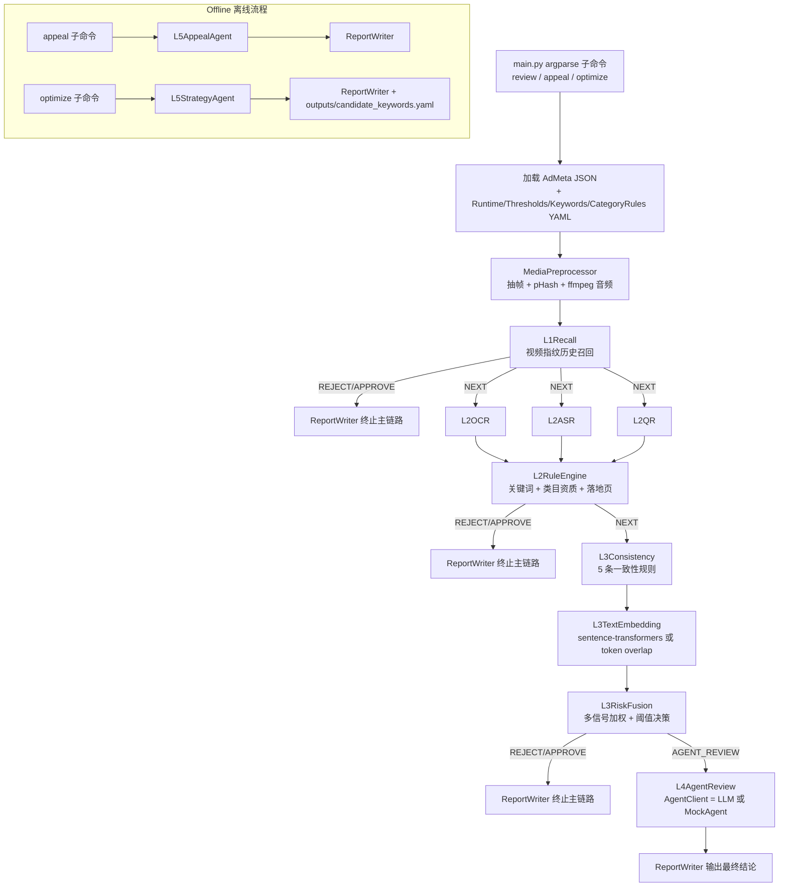
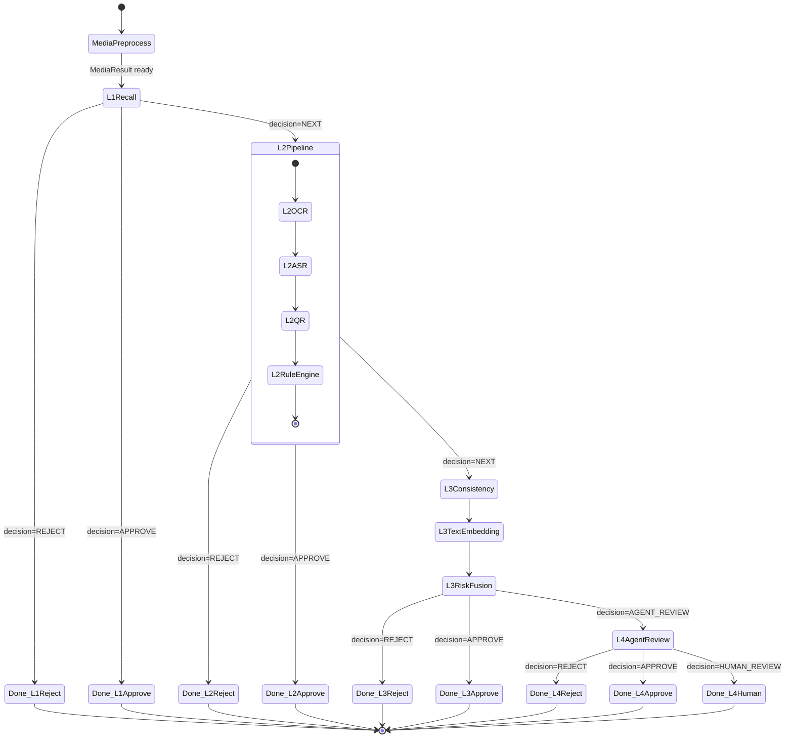

# Design Document

## Overview

本设计文档描述 `ad-review-layered-decision` 命令行广告审核 Demo 的实现方案。系统遵循"低成本前置、高成本后置"的分层处理思路，按 MediaPreprocessor → L1 → L2 → L3 → L4 → L5 的顺序执行，前层若高置信通过/拒绝则立即短路，灰区样本才进入 LLM/Agent 层。L1/L2/L3 全部基于规则/指纹/向量相似度等确定性方法，输出模板化理由；只有 L4 在线复杂复核与 L5 离线申诉/策略优化使用 Agent，且 Agent 不直接修改任何生产配置。

设计目标:

- 在 Windows 无 GPU、无 ffmpeg、无真实视频、无 LLM key 的环境下也能跑通主要测试。
- 所有重资源依赖（PaddleOCR、faster-whisper、sentence-transformers、LLM）均为可选，缺失时优雅降级。
- 输出结构化、模板化、可审计的 JSON 结论。

显式不做项 (与 Requirement 2 对齐):

- 不做 Web/可视化界面，仅命令行
- 不做图像 embedding、不做图像向量库
- 不做基于 embedding 的历史案例向量召回 (历史案例仅用文本检索)
- 不集成 YOLO 或任何对象检测模型
- 不做深度抽帧 (仅首尾帧 + 固定间隔 + 简单帧差场景帧)
- 不做抽检系统
- 不做真实落地页爬虫 (仅读 `AdMeta.landing_page.text`)
- ASR 仅使用 faster-whisper

---

## Architecture

### 1.1 总体数据流



### 1.2 主链路约束 (与 Requirement 1 对齐)

- 顺序固定: MediaPreprocessor → L1Recall → L2 (OCR/ASR/QR/RuleEngine) → L3Consistency → L3TextEmbedding → L3RiskFusion → L4AgentReview。
- 任一层输出 `APPROVE` 或 `REJECT` 立即短路。
- L1/L2/L3 模块严禁调用 LLM/Agent。
- 仅 L4/L5 允许调用 Agent；L4 输出建议但 Agent 不能修改任何配置文件；L5 输出候选词库到 `outputs/candidate_keywords.yaml` 而非 `config/`。

### 1.3 MediaResult 复用

`MediaPreprocessor` 在 review 子命令的单次执行中只调用一次，结果对象 `MediaResult` 通过 `AdReviewContext` 在各层间传递，避免重复抽帧。

---

## Components and Interfaces

本节按 `modules/*.py` 列出各模块职责、对外接口签名与依赖关系。所有签名仅描述类型契约，不展开实现。

### 2.1 modules/schemas.py

职责: 用 pydantic 定义所有跨模块共享的数据结构 (AdMeta、MediaResult、LayerResult、Decision 枚举、ReasonCode 枚举等)。详见 §3 数据模型。

### 2.2 modules/utils.py

职责: 通用工具函数。

```python
def normalize_text(text: str) -> str: ...
# 全角转半角 + 大小写统一 + 去空格 + 常见替换 (v信→微信, 1比1→1:1)

def hamming_distance(h1: str, h2: str) -> int: ...
# 16 进制 pHash 字符串汉明距离

def render_reason(template_key: ReasonCode, ctx: dict) -> str: ...
# 模板 + 结构化 ctx 渲染最终 reason 字符串

def ensure_dir(path: Path) -> Path: ...
def is_ffmpeg_available() -> bool: ...
def is_cuda_available() -> bool: ...
def load_yaml_with_default(path: Path, default: dict) -> dict: ...
# YAML 缺失/非法时回退 default 并打印 WARNING
```

依赖: `pathlib`, `subprocess` (检测 ffmpeg), `yaml`。

### 2.3 modules/media_preprocess.py

职责: 一次性完成抽帧、pHash、视频指纹、ffmpeg 音频提取，输出 `MediaResult`。

```python
class MediaPreprocessor:
    def __init__(self, runtime: RuntimeConfig, cache_root: Path): ...
    def process(self, ad: AdMeta) -> MediaResult: ...
```

依赖: `cv2` (OpenCV), `imagehash`, `PIL`, `subprocess` (ffmpeg), `utils`。

### 2.4 modules/l1_history_recall.py

职责: 使用 `data/history_fingerprints.json` 进行视频指纹召回。

```python
class L1Recall:
    def __init__(self, fingerprints_path: Path, thresholds: Thresholds): ...
    def recall(self, media: MediaResult) -> LayerResult: ...
```

依赖: `utils.hamming_distance`, `schemas`。**禁止**依赖 OCR/ASR/LLM。

### 2.5 modules/l2_ocr.py

职责: 对关键帧执行 OCR (PaddleOCR 真实模式或 mock)。

```python
class L2OCR:
    def __init__(self, runtime: RuntimeConfig): ...
    def extract(self, ad: AdMeta, media: MediaResult) -> list[FrameOCR]: ...
    # FrameOCR = {frame_id, frame_path, texts: list[str]}
```

依赖: 可选 `paddleocr` (缺失时自动 fallback)。

### 2.6 modules/l2_asr.py

职责: 调用 faster-whisper 进行 ASR；CUDA/ffmpeg/模型缺失时回退到 `AdMeta.mock_asr_text`。

```python
class L2ASR:
    def __init__(self, runtime: RuntimeConfig): ...
    def transcribe(self, ad: AdMeta, media: MediaResult) -> ASRResult: ...
    # ASRResult = {text: str, mock: bool, fallback_reason: str | None}
```

依赖: 可选 `faster_whisper`, `utils.is_cuda_available`, `utils.is_ffmpeg_available`。

### 2.7 modules/l2_qr.py

职责: OpenCV `QRCodeDetector` 关键帧二维码检测，识别私域引流。

```python
class L2QR:
    def __init__(self, runtime: RuntimeConfig): ...
    def detect(self, media: MediaResult) -> list[QRHit]: ...
    # QRHit = {frame_id, decoded_text, is_private_drainage: bool}
```

依赖: `cv2`。

### 2.8 modules/l2_rule_engine.py

职责: 合并 OCR/ASR/标题/描述/落地页文本，执行关键词、归一化、类目资质、落地页规则匹配。

```python
class L2RuleEngine:
    def __init__(
        self,
        keywords: KeywordsConfig,
        category_rules: CategoryRulesConfig,
        thresholds: Thresholds,
    ): ...
    def evaluate(
        self,
        ad: AdMeta,
        ocr: list[FrameOCR],
        asr: ASRResult,
        qr: list[QRHit],
    ) -> LayerResult: ...
```

依赖: `utils.normalize_text`, `schemas`。

### 2.9 modules/l3_consistency.py

职责: 实现 5 条素材-落地页-类目-资质一致性规则。

```python
class L3Consistency:
    def __init__(self): ...
    def check(self, ad: AdMeta, l2: LayerResult) -> ConsistencyResult: ...
    # ConsistencyResult = {signals: list[Signal], extra_score: int}
```

### 2.10 modules/l3_text_embedding.py (子模块, 也可放在 l3_risk_fusion 内部)

职责: 计算 AdClaimText 与 LandingText 的语义相似度。

```python
class L3TextEmbedding:
    def __init__(self, runtime: RuntimeConfig): ...
    def similarity(self, ad_claim: str, landing_text: str) -> SimilarityResult: ...
    # SimilarityResult = {score: float, backend: "sbert" | "token_overlap"}
```

依赖: 可选 `sentence_transformers` (缺失自动回退到 token overlap)。

### 2.11 modules/l3_risk_fusion.py

职责: 汇总 L1/L2/L3Consistency/L3TextEmbedding 的信号，加权得到 risk_score 并按阈值决策。

```python
class L3RiskFusion:
    def __init__(self, thresholds: Thresholds): ...
    def fuse(
        self,
        ad: AdMeta,
        l1: LayerResult,
        l2: LayerResult,
        consistency: ConsistencyResult,
        embedding: SimilarityResult,
    ) -> LayerResult: ...
```

### 2.12 modules/agent_client.py

职责: LLM 调用封装与 MockAgent fallback、JSON 修复。

```python
class AgentClient:
    def __init__(self, runtime: RuntimeConfig): ...
    def is_real(self) -> bool: ...
    def call(self, system: str, user: str, schema_hint: dict) -> AgentResponse: ...
    # AgentResponse = {parsed: dict, raw: str, repair_applied: bool, error: bool}

class MockAgent:
    def call(self, system: str, user: str, schema_hint: dict) -> AgentResponse: ...
```

依赖: `python-dotenv`, 可选 `openai` 或 `requests` (用于 OpenAI-compatible API)。

### 2.13 modules/l4_agent_review.py

职责: 在 L3RiskFusion 输出 `AGENT_REVIEW` 时调用 Agent 复核。

```python
class L4AgentReview:
    def __init__(
        self,
        agent: AgentClient,
        thresholds: Thresholds,
        policy_docs_path: Path,
        history_cases_path: Path,
    ): ...
    def review(
        self,
        ad: AdMeta,
        l1: LayerResult,
        l2: LayerResult,
        l3: LayerResult,
        media: MediaResult,
    ) -> LayerResult: ...
```

工具能力 (仅文本):

- `policy_rag(query: str) -> list[str]`
- `history_case_rag(query: str) -> list[str]`
- `evidence_compose(...) -> str` (纯本地拼接)

### 2.14 modules/l5_appeal_agent.py

职责: 接受 `samples/appeal_xxx.json`，结合原始审核结论与 `policy_docs.json` 生成申诉建议。

```python
class L5AppealAgent:
    def __init__(self, agent: AgentClient, policy_docs_path: Path): ...
    def review_appeal(self, appeal: AppealInput, original: ReviewResult | None) -> AppealResult: ...
```

### 2.15 modules/l5_strategy_agent.py

职责: 分析 `data/optimization_logs.json`，发现候选黑话与策略问题。

```python
class L5StrategyAgent:
    def __init__(self, agent: AgentClient): ...
    def analyze(self, logs: list[OptimizationLog]) -> StrategyResult: ...
    def write_candidate_keywords(self, suggestions: list[Suggestion], path: Path) -> None: ...
```

### 2.16 modules/report_writer.py

职责: 控制台打印 + JSON 写出。

```python
class ReportWriter:
    def __init__(self, output_root: Path): ...
    def print_layer(self, name: str, result: LayerResult) -> None: ...
    def write_review(self, ad_id: str, summary: ReviewSummary) -> Path: ...
    def write_appeal(self, appeal_id: str, result: AppealResult) -> Path: ...
    def write_strategy(self, result: StrategyResult) -> Path: ...
```

### 2.17 main.py

职责: argparse 子命令分发、错误处理、退出码。详见 §12。

---

## Data Models

所有模型定义在 `modules/schemas.py`，使用 `pydantic.BaseModel`。下面给出关键字段、类型、默认值与校验规则。

### 3.1 枚举类型

```python
from enum import Enum

class Decision(str, Enum):
    APPROVE = "APPROVE"
    REJECT = "REJECT"
    NEXT = "NEXT"
    AGENT_REVIEW = "AGENT_REVIEW"
    HUMAN_REVIEW = "HUMAN_REVIEW"

class ReasonCode(str, Enum):
    # L1
    L1_HISTORY_VIOLATION_HIT = "L1_HISTORY_VIOLATION_HIT"
    L1_HISTORY_SAFE_HIT = "L1_HISTORY_SAFE_HIT"
    L1_NO_MATCH = "L1_NO_MATCH"
    # L2 keywords
    L2_HARD_BLOCK_HIT = "L2_HARD_BLOCK_HIT"
    L2_NORMALIZED_BLOCK_HIT = "L2_NORMALIZED_BLOCK_HIT"
    L2_SUSPICIOUS_SLANG_HIT = "L2_SUSPICIOUS_SLANG_HIT"
    # L2 category
    L2_MISSING_BRAND_AUTHORIZATION = "L2_MISSING_BRAND_AUTHORIZATION"
    L2_MISSING_FINANCIAL_LICENSE = "L2_MISSING_FINANCIAL_LICENSE"
    L2_MISSING_MEDICAL_LICENSE = "L2_MISSING_MEDICAL_LICENSE"
    # L2 landing
    L2_PRIVATE_DOMAIN_DRAINAGE = "L2_PRIVATE_DOMAIN_DRAINAGE"
    L2_PRICE_INCONSISTENT = "L2_PRICE_INCONSISTENT"
    # L3
    L3_OFFICIAL_NO_AUTHORIZATION = "L3_OFFICIAL_NO_AUTHORIZATION"
    L3_OFFICIAL_VS_CHANNEL = "L3_OFFICIAL_VS_CHANNEL"
    L3_PRICE_CONFLICT = "L3_PRICE_CONFLICT"
    L3_CATEGORY_MISMATCH = "L3_CATEGORY_MISMATCH"
    L3_PRIVATE_DOMAIN_CONFLICT = "L3_PRIVATE_DOMAIN_CONFLICT"
    L3_LOW_SEMANTIC_SIMILARITY = "L3_LOW_SEMANTIC_SIMILARITY"
    L3_RISK_SCORE_OVER_REJECT = "L3_RISK_SCORE_OVER_REJECT"
    L3_RISK_SCORE_UNDER_APPROVE = "L3_RISK_SCORE_UNDER_APPROVE"
    L3_AGENT_REVIEW = "L3_AGENT_REVIEW"
    # L4
    L4_AGENT_DECISION = "L4_AGENT_DECISION"
    L4_AGENT_LOW_CONFIDENCE = "L4_AGENT_LOW_CONFIDENCE"
    L4_AGENT_OUTPUT_INVALID = "L4_AGENT_OUTPUT_INVALID"
    L4_HIGH_SENSITIVE_CATEGORY = "L4_HIGH_SENSITIVE_CATEGORY"

class SignalSource(str, Enum):
    OCR = "ocr"
    ASR = "asr"
    QR = "qr"
    KEYWORD = "keyword"
    CATEGORY = "category"
    LANDING_PAGE = "landing_page"
    HISTORY = "history"
    EMBEDDING = "embedding"
    CONSISTENCY = "consistency"
```

### 3.2 输入: AdMeta 与子结构

```python
from pydantic import BaseModel, Field, field_validator

class Qualification(BaseModel):
    business_license: str | None = None
    brand_authorization: str | None = None
    financial_license: str | None = None
    medical_license: str | None = None

class Merchant(BaseModel):
    merchant_id: str
    qualification: Qualification = Field(default_factory=Qualification)
    history_violation_count: int = 0

class LandingPage(BaseModel):
    url: str = ""
    text: str = ""
    price: float | None = None  # None 表示未声明

class AdMeta(BaseModel):
    ad_id: str
    media_type: str = "video"           # video | image
    media_path: str = ""
    title: str = ""
    description: str = ""
    category: str = "其他"               # 箱包 | 金融 | 医疗 | 日用品 | 其他
    brand: str = ""
    mock_asr_text: str = ""             # 视频缺失或 ASR 失败时的兜底
    mock_ocr_texts: list[str] = Field(default_factory=list)
    landing_page: LandingPage = Field(default_factory=LandingPage)
    merchant: Merchant

    @field_validator("ad_id")
    @classmethod
    def _ad_id_non_empty(cls, v: str) -> str:
        if not v.strip():
            raise ValueError("ad_id must not be empty")
        return v
```

### 3.3 媒体预处理输出

```python
class FrameRef(BaseModel):
    frame_id: str          # f"frame_{idx:04d}"
    frame_path: str        # outputs/cache/{ad_id}/frames/frame_xxxx.jpg
    timestamp_sec: float

class VideoFingerprint(BaseModel):
    phash_list: list[str] = Field(default_factory=list)   # 16 进制字符串
    frame_count: int = 0

class MediaResult(BaseModel):
    ad_id: str
    mock: bool = False                  # 视频缺失或解码失败时为 True
    fallback_reason: str | None = None
    duration_sec: float = 0.0
    fps: float = 0.0
    width: int = 0
    height: int = 0
    sampled_frames: list[FrameRef] = Field(default_factory=list)
    fingerprint: VideoFingerprint = Field(default_factory=VideoFingerprint)
    audio_path: str | None = None
```

### 3.4 各层输出

```python
class Signal(BaseModel):
    source: SignalSource
    code: ReasonCode
    detail: str = ""                    # 命中词 / 命中文本 / 帧 ID
    score_delta: int = 0

class Evidence(BaseModel):
    source: SignalSource
    raw: str = ""
    normalized: str = ""
    location: str = ""                  # frame_id / "title" / "landing_page" / etc.

class LayerResult(BaseModel):
    layer: str                          # "L1" / "L2" / "L3" / "L4"
    decision: Decision
    risk_score: int = 0
    reason_code: ReasonCode | None = None
    reason: str = ""                    # 模板渲染后的可读文本
    signals: list[Signal] = Field(default_factory=list)
    evidence: list[Evidence] = Field(default_factory=list)
    extra: dict = Field(default_factory=dict)   # 各层私有字段, 例如 L4 的 confidence
```

### 3.5 Agent 输出

```python
class AgentResponse(BaseModel):
    parsed: dict
    raw: str
    repair_applied: bool = False
    error: bool = False
    error_reason: str | None = None

class L4AgentJSON(BaseModel):
    decision: str                       # REJECT | APPROVE | HUMAN_REVIEW
    confidence: float
    risk_types: list[str] = Field(default_factory=list)
    evidence_chain: list[str] = Field(default_factory=list)
    policy_refs: list[str] = Field(default_factory=list)
    reason: str = ""
    next_action: str = ""

class AppealResult(BaseModel):
    appeal_id: str
    appeal_suggestion: str              # KEEP_REJECT | SUGGEST_APPROVE_AFTER_HUMAN_REVIEW | NEED_MORE_MATERIALS | HUMAN_REVIEW
    confidence: float
    reason: str
    required_extra_materials: list[str] = Field(default_factory=list)
    policy_refs: list[str] = Field(default_factory=list)

class Suggestion(BaseModel):
    type: str                           # "keyword" | "rule"
    words: list[str] = Field(default_factory=list)
    action: str                         # "add_to_suspicious_slang" | "add_to_normalized_block" | ...
    route: str                          # "L3" | "L2" | ...

class StrategyResult(BaseModel):
    optimization_target: str
    problem: str
    suggestions: list[Suggestion]
    validation_plan: str
    risk: str
    requires_human_approval: bool = True
```

### 3.6 配置

```python
class RuntimeConfig(BaseModel):
    max_sampled_frames: int = 12
    sample_interval_sec: float = 1.0
    phash_resize: int = 64
    enable_ocr: bool = False
    enable_asr: bool = True
    asr_model_size: str = "small"
    asr_device: str = "auto"            # auto | cuda | cpu
    asr_compute_type: str = "int8_float16"
    enable_qr: bool = True
    enable_text_embedding: bool = True
    llm_enabled: str = "auto"           # auto | true | false

class Thresholds(BaseModel):
    l1_history_match_threshold: float = 0.85    # 相似帧比例下限
    l1_hamming_threshold: int = 8               # 单帧 pHash 视为相似的汉明距离上限
    l2_reject_score: int = 60
    l3_reject_score: int = 85
    l3_approve_score: int = 20
    agent_confidence_auto_threshold: float = 0.7
```

---

## State Machine - Main Pipeline Short-Circuiting

下图描述 review 子命令主链路的状态转移。`MediaPreprocessor` 在进入任何状态前已经执行完毕，结果通过共享上下文传递。



不变式 (供 §Correctness Properties 引用):

- 一旦某层进入 `Done_*` 状态，下游模块的 `evaluate/check/fuse/review` 不会被调用。
- L4 状态仅可由 L3RiskFusion 输出 `AGENT_REVIEW` 进入。

---

## Configuration Loading Strategy

### 5.1 加载顺序

main.py 启动时按顺序加载，每一步失败都不阻断进程，而是 fallback 到代码内置默认值并打印 ERROR 日志:

1. `python-dotenv` 加载 `.env` (仅供 AgentClient 使用，缺失不报错)
2. `config/runtime.yaml` → `RuntimeConfig`
3. `config/thresholds.yaml` → `Thresholds`
4. `config/keywords.yaml` → `KeywordsConfig` (三类词库)
5. `config/category_rules.yaml` → `CategoryRulesConfig`

### 5.2 缺失/格式错误降级策略

```python
def load_config(path: Path, model: type[BaseModel], default: dict) -> BaseModel:
    if not path.exists():
        logger.error("Config %s not found, using built-in defaults", path)
        return model(**default)
    try:
        raw = yaml.safe_load(path.read_text(encoding="utf-8")) or {}
        return model(**raw)
    except (yaml.YAMLError, ValidationError) as e:
        logger.error("Config %s invalid (%s), using built-in defaults", path, e)
        return model(**default)
```

代码内置默认值 (与 §3.6 一致):

- `RuntimeConfig`: 字段全部带默认值，可空字典构造
- `Thresholds`: 字段全部带默认值
- `KeywordsConfig`: `{hard_block: [], normalized_block: [], suspicious_slang: []}`
- `CategoryRulesConfig`: `{rules: []}`

### 5.3 错误日志规范

- ERROR 级别: 配置加载失败、Agent 调用失败但已 fallback
- WARNING 级别: 可选依赖缺失 (PaddleOCR/sentence-transformers/ffmpeg/CUDA)
- INFO 级别: 每层进入与决策结果摘要
- 使用标准库 `logging`，统一格式 `%(asctime)s [%(levelname)s] %(name)s: %(message)s`

---

## MediaPreprocessor Design

### 6.1 抽帧策略

仅做以下三类抽帧 (与 Requirement 2.6 不做深度抽帧对齐):

1. 首帧 (idx=0) 与 尾帧 (idx=last)
2. 固定间隔帧: 每 `runtime.sample_interval_sec` 秒取一帧
3. 简单帧差场景帧: 相邻采样帧灰度直方图差异超过经验阈值 (例如 0.4) 时记为场景帧

伪代码:

```python
def sample_frames(cap: cv2.VideoCapture, runtime: RuntimeConfig) -> list[Frame]:
    frames = [first_frame, last_frame]
    step = int(runtime.sample_interval_sec * fps)
    for idx in range(step, frame_count - 1, step):
        frames.append(read_at(idx))
    # 加入帧差场景帧
    for i in range(1, len(frames)):
        if hist_diff(frames[i-1], frames[i]) > 0.4:
            mark_as_scene_keyframe(frames[i])
    return dedup_by_phash(frames)[: runtime.max_sampled_frames]
```

### 6.2 pHash 与去重

```python
def phash_of_frame(frame: np.ndarray, resize: int) -> str:
    img = cv2.resize(frame, (resize, resize))
    pil = PIL.Image.fromarray(cv2.cvtColor(img, cv2.COLOR_BGR2GRAY))
    return str(imagehash.phash(pil))   # 16 进制字符串

def dedup_by_phash(frames: list[Frame], hamming_threshold: int = 4) -> list[Frame]:
    kept: list[Frame] = []
    for f in frames:
        if all(hamming(f.phash, k.phash) > hamming_threshold for k in kept):
            kept.append(f)
    return kept
```

resize 必须在 pHash 之前进行 (Requirement 27.8)，以控制成本。

### 6.3 缓存目录结构

```
outputs/
└── cache/
    └── {ad_id}/
        ├── frames/
        │   ├── frame_0000.jpg
        │   ├── frame_0001.jpg
        │   └── ...
        └── audio.wav   # ffmpeg 提取, 缺 ffmpeg 时不存在
```

ad_id 经 `re.sub(r"[^A-Za-z0-9_-]", "_", ad_id)` 清洗后用于目录名，避免跨平台路径问题。

### 6.4 ffmpeg 调用与降级

```python
def extract_audio(media_path: Path, audio_out: Path) -> Path | None:
    if not is_ffmpeg_available():
        logger.warning("ffmpeg not available, skip audio extraction")
        return None
    try:
        subprocess.run(
            ["ffmpeg", "-y", "-i", str(media_path), "-vn", "-ac", "1",
             "-ar", "16000", str(audio_out)],
            check=True, capture_output=True, timeout=60,
        )
        return audio_out
    except (subprocess.CalledProcessError, subprocess.TimeoutExpired) as e:
        logger.warning("ffmpeg failed: %s", e)
        return None
```

`is_ffmpeg_available` 通过 `subprocess.run(["ffmpeg", "-version"])` 检测，捕获 `FileNotFoundError`。

### 6.5 视频缺失分支

```python
if not Path(ad.media_path).exists():
    logger.warning("media_path %s missing, returning mock MediaResult", ad.media_path)
    return MediaResult(ad_id=ad.ad_id, mock=True, fallback_reason="media_missing")
```

---

## L1 History Recall Design

### 7.1 history_fingerprints.json 结构

```json
{
  "fingerprints": [
    {
      "history_id": "hist_001",
      "label": "violation",                
      "phash_list": ["a1b2c3d4...", "..."],
      "violation_type": "brand_counterfeit",
      "note": "1:1 复刻 LV 经典款"
    },
    {
      "history_id": "hist_002",
      "label": "safe",                     
      "phash_list": ["..."],
      "note": "已通过的日用品广告"
    }
  ]
}
```

`label` 仅 `violation | safe`。

### 7.2 匹配算法

```python
def match(media: MediaResult, hist: HistoryFingerprint, thresholds: Thresholds) -> MatchResult:
    similar_frame_count = 0
    for cur_phash in media.fingerprint.phash_list:
        for hist_phash in hist.phash_list:
            if hamming(cur_phash, hist_phash) <= thresholds.l1_hamming_threshold:
                similar_frame_count += 1
                break
    similar_ratio = similar_frame_count / max(len(media.fingerprint.phash_list), 1)
    return MatchResult(history_id=hist.history_id, ratio=similar_ratio)
```

判定:

```python
best = max(matches, key=lambda m: m.ratio, default=None)
if best is None or best.ratio < thresholds.l1_history_match_threshold:
    return LayerResult(layer="L1", decision=Decision.NEXT, reason_code=ReasonCode.L1_NO_MATCH, ...)
if best.label == "violation":
    return LayerResult(decision=Decision.REJECT, reason_code=ReasonCode.L1_HISTORY_VIOLATION_HIT, ...)
if best.label == "safe":
    return LayerResult(decision=Decision.APPROVE, reason_code=ReasonCode.L1_HISTORY_SAFE_HIT, ...)
```

L1 不触碰 OCR/ASR/LLM，符合 Requirement 8.6。

---

## L2 Submodule Design

### 8.1 L2OCR

```python
class L2OCR:
    def extract(self, ad: AdMeta, media: MediaResult) -> list[FrameOCR]:
        if not self.runtime.enable_ocr or not self._paddleocr_available():
            # 使用 ad.mock_ocr_texts; 缺失则空列表
            return self._mock_from_ad(ad, media)
        results = []
        for f in media.sampled_frames:
            try:
                texts = self._run_paddle_with_timeout(f.frame_path, timeout_sec=10)
                results.append(FrameOCR(frame_id=f.frame_id, texts=texts))
            except Exception as e:
                logger.warning("OCR failed on %s: %s", f.frame_id, e)
                results.append(FrameOCR(frame_id=f.frame_id, texts=[]))
        return results
```

PaddleOCR 切换:

- `runtime.enable_ocr=True` 且 `import paddleocr` 成功 → 真实模式
- 否则 mock，从 `ad.mock_ocr_texts` 读取

单帧超时通过 `concurrent.futures.ThreadPoolExecutor` + `future.result(timeout=10)` 实现。

### 8.2 L2ASR

```python
class L2ASR:
    def transcribe(self, ad: AdMeta, media: MediaResult) -> ASRResult:
        if not self.runtime.enable_asr:
            return ASRResult(text=ad.mock_asr_text, mock=True, fallback_reason="disabled")
        if media.mock or media.audio_path is None:
            return ASRResult(text=ad.mock_asr_text, mock=True, fallback_reason="no_audio")
        device, compute = self._resolve_device()
        try:
            model = self._load_model(self.runtime.asr_model_size, device, compute)
            segments, _ = model.transcribe(media.audio_path)
            text = " ".join(seg.text for seg in segments)
            return ASRResult(text=text, mock=False)
        except Exception as e:
            logger.warning("faster-whisper failed: %s", e)
            return ASRResult(text=ad.mock_asr_text, mock=True, fallback_reason=f"model_error:{e}")
```

设备解析:

```python
def _resolve_device(self) -> tuple[str, str]:
    cfg = self.runtime.asr_device
    if cfg == "cuda":
        if not is_cuda_available():
            raise ConfigError("asr_device=cuda but CUDA not available")  # Requirement 10.4
        return "cuda", "float16"
    if cfg == "cpu":
        return "cpu", "int8"
    # auto
    return ("cuda", "float16") if is_cuda_available() else ("cpu", "int8")
```

Fallback 链: cuda(失败) → cpu(失败) → mock_asr_text。其中 `cuda` 显式配置时不静默回退 (满足 Requirement 10.4)；`auto` 模式才允许逐级降级。

### 8.3 L2QR

```python
class L2QR:
    def detect(self, media: MediaResult) -> list[QRHit]:
        if not self.runtime.enable_qr or media.mock:
            return []
        detector = cv2.QRCodeDetector()
        hits = []
        for f in media.sampled_frames:
            img = cv2.imread(f.frame_path)
            decoded, points, _ = detector.detectAndDecode(img)
            if decoded:
                hits.append(QRHit(
                    frame_id=f.frame_id,
                    decoded_text=decoded,
                    is_private_drainage=self._is_private_drainage(decoded),
                ))
        return hits

    def _is_private_drainage(self, text: str) -> bool:
        norm = normalize_text(text)
        return any(kw in norm for kw in ["微信", "vx", "wechat"]) \
            or bool(re.search(r"1[3-9]\d{9}", norm)) \
            or norm.startswith("http")
```

### 8.4 L2RuleEngine

#### 8.4.1 keywords.yaml 结构

```yaml
hard_block:
  - {word: "1:1复刻", category: "all"}
  - {word: "高仿", category: "all"}
  - {word: "A货", category: "all"}
  - {word: "稳赚不赔", category: "金融"}
normalized_block:
  - {word: "1比1", category: "all"}             # 归一化后等价 1:1
  - {word: "v信", category: "all"}              # 归一化后等价 微信
suspicious_slang:
  - {word: "柜姐渠道", category: "箱包"}
  - {word: "原厂尾单", category: "箱包"}
  - {word: "懂的来", category: "箱包"}
  - {word: "渠道价", category: "箱包"}
  - {word: "内部福利", category: "all"}
```

#### 8.4.2 文本归一化算法

`utils.normalize_text` 分四步:

1. Unicode NFKC 归一化 (全角转半角)
2. 转小写
3. 删除空格与标点 (保留中英文与数字)
4. 应用替换表: `{"v信": "微信", "Ｖ信": "微信", "1比1": "1:1", "wx": "微信"}`

```python
_REPLACE_TABLE = {"v信": "微信", "ｖ信": "微信", "1比1": "1:1", "wx": "微信"}

def normalize_text(text: str) -> str:
    s = unicodedata.normalize("NFKC", text).lower()
    s = re.sub(r"[\s\u3000]+", "", s)
    for k, v in _REPLACE_TABLE.items():
        s = s.replace(k, v)
    return s
```

#### 8.4.3 类目资质校验

```python
def check_qualification(ad: AdMeta, claim_text: str, rules: CategoryRulesConfig) -> list[Signal]:
    signals = []
    cat = ad.category
    norm = normalize_text(claim_text)
    if cat == "箱包" and any(w in norm for w in ["官方正品", "专柜品质", "专柜正品"]):
        if not ad.merchant.qualification.brand_authorization:
            signals.append(Signal(code=ReasonCode.L2_MISSING_BRAND_AUTHORIZATION, score_delta=30, ...))
    if cat == "金融":
        if not ad.merchant.qualification.financial_license:
            signals.append(Signal(code=ReasonCode.L2_MISSING_FINANCIAL_LICENSE, score_delta=30, ...))
        # 敏感宣称 + 缺金融资质 = REJECT
        if any(w in norm for w in ["稳赚", "保本", "高收益"]) and not ad.merchant.qualification.financial_license:
            signals.append(Signal(code=ReasonCode.L2_HARD_BLOCK_HIT, score_delta=40, ...))
    if cat == "医疗" or any(w in norm for w in ["治疗", "疗效", "根治"]):
        if not ad.merchant.qualification.medical_license:
            signals.append(Signal(code=ReasonCode.L2_MISSING_MEDICAL_LICENSE, score_delta=30, ...))
    return signals
```

#### 8.4.4 落地页基础规则

仅读取 `ad.landing_page.text` 与 `ad.landing_page.price`，不发起任何网络请求 (Requirement 14.1)。

```python
def check_landing(ad: AdMeta, qr_hits: list[QRHit], norm_claim: str) -> list[Signal]:
    signals = []
    norm_landing = normalize_text(ad.landing_page.text)
    drainage_words = ["微信咨询", "加微信", "vx", "私聊"]
    if any(w in norm_landing for w in drainage_words) or any(q.is_private_drainage for q in qr_hits):
        signals.append(Signal(code=ReasonCode.L2_PRIVATE_DOMAIN_DRAINAGE, score_delta=20, ...))
    if any(w in norm_claim for w in ["低价", "免费"]) and ad.landing_page.price and ad.landing_page.price > 100:
        signals.append(Signal(code=ReasonCode.L2_PRICE_INCONSISTENT, score_delta=10, ...))
    return signals
```

#### 8.4.5 L2 输出契约

`L2RuleEngine.evaluate` 返回 `LayerResult(layer="L2", ...)`，其中:

- 任一 HardBlock/归一化 Block 命中 → `decision=REJECT`, `reason_code=L2_HARD_BLOCK_HIT` 或 `L2_NORMALIZED_BLOCK_HIT`
- SuspiciousSlang 命中 → `decision=NEXT`, 加中风险分 (15)
- 命中无敏感信号且 risk_score 低于 `Thresholds.l2_reject_score` (默认 60) → `decision=NEXT`
- 不存在 `decision=APPROVE` 的快速通道 (L2 不主动 APPROVE，统一交给 L3)

`signals` 中每个条目带 `source` (OCR/ASR/QR/keyword/category/landing_page) 与命中文本，便于审计。

### 8.5 文本汇总

供 L2RuleEngine 与 L3 使用的拼接函数:

```python
def build_ad_claim_text(ad: AdMeta, ocr: list[FrameOCR], asr: ASRResult) -> str:
    parts = [ad.title, ad.description]
    parts.extend(t for f in ocr for t in f.texts)
    parts.append(asr.text)
    return "\n".join(p for p in parts if p)
```

---

## L3 Design

### 9.1 L3Consistency

5 条规则的伪代码 (与 Requirement 16 一一对应):

```python
def check(ad: AdMeta, l2: LayerResult) -> ConsistencyResult:
    signals = []
    norm_claim = normalize_text(build_ad_claim_text(...))
    norm_landing = normalize_text(ad.landing_page.text)

    # 16.1
    if "官方正品" in norm_claim and not ad.merchant.qualification.brand_authorization:
        signals.append(Signal(code=L3_OFFICIAL_NO_AUTHORIZATION, score_delta=30, ...))

    # 16.2
    if "正品" in norm_claim and any(w in norm_landing for w in ["渠道货", "尾单", "复刻"]):
        signals.append(Signal(code=L3_OFFICIAL_VS_CHANNEL, score_delta=20, ...))

    # 16.3
    if any(w in norm_claim for w in ["低价", "免费"]) and ad.landing_page.price and ad.landing_page.price > 100:
        signals.append(Signal(code=L3_PRICE_CONFLICT, score_delta=20, ...))

    # 16.4
    sensitive_words_in_text = any(w in norm_claim + norm_landing for w in ["减肥", "治疗", "理财", "投资"])
    if ad.category == "日用品" and sensitive_words_in_text:
        signals.append(Signal(code=L3_CATEGORY_MISMATCH, score_delta=30, ...))

    # 16.5
    if any(w in norm_claim for w in ["平台内购买", "站内下单"]) and any(w in norm_landing for w in ["微信咨询", "私聊"]):
        signals.append(Signal(code=L3_PRIVATE_DOMAIN_CONFLICT, score_delta=25, ...))

    return ConsistencyResult(signals=signals, extra_score=sum(s.score_delta for s in signals))
```

### 9.2 L3TextEmbedding

```python
def similarity(self, ad_claim: str, landing_text: str) -> SimilarityResult:
    if not self.runtime.enable_text_embedding or not self._sbert_available():
        return SimilarityResult(score=token_overlap(ad_claim, landing_text), backend="token_overlap")
    try:
        emb = self._sbert.encode([ad_claim, landing_text], normalize_embeddings=True)
        score = float(np.dot(emb[0], emb[1]))
        return SimilarityResult(score=score, backend="sbert")
    except Exception as e:
        logger.warning("sbert failed: %s", e)
        return SimilarityResult(score=token_overlap(ad_claim, landing_text), backend="token_overlap")

def token_overlap(a: str, b: str) -> float:
    ta, tb = set(jieba_or_char_tokens(a)), set(jieba_or_char_tokens(b))
    if not ta or not tb:
        return 0.0
    return len(ta & tb) / len(ta | tb)
```

注意 (Requirement 17.5): L3TextEmbedding 仅用于文本，不用于图像/视频帧。

### 9.3 L3RiskFusion

#### 9.3.1 加分表 (建议默认)

| 信号 | score_delta |
| --- | --- |
| HardBlockKeyword | +40 |
| NormalizedBlockKeyword | +35 |
| SuspiciousSlang | +15 |
| 缺失必要资质 (品牌/金融/医疗) | +30 |
| 落地页高风险 (drainage/inconsistent_price) | +20 |
| 二维码私域引流 | +20 |
| 商家历史违规 (`history_violation_count > 0`) | +10 |
| 素材-落地页不一致 (L3Consistency) | +20 |
| 类目错挂 | +30 |
| 文本语义相似度低 (`L3_LOW_SEMANTIC_SIMILARITY`) | +10 |

#### 9.3.2 决策阈值与冲突信号

```python
def fuse(...) -> LayerResult:
    total = sum_all_signal_deltas(l1, l2, consistency, embedding, history_violation, ...)
    has_conflict = any(s.code in CONFLICT_CODES for s in all_signals)

    if total >= thresholds.l3_reject_score:           # 默认 85
        return LayerResult(decision=REJECT, reason_code=L3_RISK_SCORE_OVER_REJECT, ...)
    if total <= thresholds.l3_approve_score and not has_conflict:   # 默认 20
        return LayerResult(decision=APPROVE, reason_code=L3_RISK_SCORE_UNDER_APPROVE, ...)
    return LayerResult(decision=AGENT_REVIEW, reason_code=L3_AGENT_REVIEW, ...)
```

`CONFLICT_CODES` 定义为:

```python
CONFLICT_CODES = {
    ReasonCode.L3_OFFICIAL_NO_AUTHORIZATION,
    ReasonCode.L3_OFFICIAL_VS_CHANNEL,
    ReasonCode.L3_PRICE_CONFLICT,
    ReasonCode.L3_CATEGORY_MISMATCH,
    ReasonCode.L3_PRIVATE_DOMAIN_CONFLICT,
}
```

存在冲突信号时即使 risk_score 很低也强制进入 AGENT_REVIEW，避免漏判。

L3RiskFusion 同样使用模板生成 `reason`，禁止调用 LLM。

---

## L4 Agent Review Design

### 10.1 AgentClient 抽象接口

```python
class AgentClient:
    """OpenAI-compatible API + MockAgent fallback."""

    def __init__(self, runtime: RuntimeConfig):
        load_dotenv()
        self._mode = self._resolve_mode(runtime.llm_enabled)   # "real" | "mock"

    def _resolve_mode(self, llm_enabled: str) -> str:
        if llm_enabled == "false":
            return "mock"
        api_key = os.getenv("LLM_API_KEY")
        if llm_enabled == "auto":
            return "real" if api_key else "mock"
        if llm_enabled == "true":
            return "real" if api_key else "mock"
        return "mock"

    def call(self, system: str, user: str, schema_hint: dict) -> AgentResponse:
        if self._mode == "mock":
            return MockAgent().call(system, user, schema_hint)
        try:
            raw = self._call_openai_compat(system, user)
        except Exception as e:
            logger.warning("LLM call failed (%s), falling back to MockAgent", e)
            return MockAgent().call(system, user, schema_hint)
        return self._parse_with_repair(raw)
```

### 10.2 JSON 修复策略

JSON 修复必须在同一调用中**原子性**完成 (Requirement 22.3)，不允许"已检测到失败但尚未修复"的中间状态。

```python
def _parse_with_repair(self, raw: str) -> AgentResponse:
    try:
        return AgentResponse(parsed=json.loads(raw), raw=raw, repair_applied=False)
    except json.JSONDecodeError:
        repaired = self._repair_json(raw)
        if repaired is None:
            return AgentResponse(
                parsed=self._fallback_payload(),
                raw=raw,
                repair_applied=False,
                error=True,
                error_reason="json_unrecoverable",
            )
        try:
            return AgentResponse(parsed=json.loads(repaired), raw=raw, repair_applied=True)
        except json.JSONDecodeError:
            return AgentResponse(
                parsed=self._fallback_payload(),
                raw=raw,
                repair_applied=False,
                error=True,
                error_reason="json_repair_failed",
            )

def _repair_json(self, raw: str) -> str | None:
    # 1. 裁剪 ```json ... ``` 包裹
    # 2. 找到第一个 { 与最后一个 }, 取闭合区间
    # 3. 修复尾部缺失的 } / ]
    m = re.search(r"\{.*\}", raw, re.DOTALL)
    return m.group(0) if m else None

def _fallback_payload(self) -> dict:
    return {
        "decision": "HUMAN_REVIEW",
        "confidence": 0.0,
        "risk_types": ["json_invalid"],
        "evidence_chain": [],
        "policy_refs": [],
        "reason": "Agent returned invalid JSON, fallback to HUMAN_REVIEW",
        "next_action": "human_review",
    }
```

### 10.3 L4 Prompt 结构

系统提示 (固定):

```
你是广告合规复核 Agent。你必须严格输出 JSON, 不允许包含任何解释性文字。
你不能调用任何修改文件、修改配置、访问网络、加载图像 embedding 的工具。
你只能引用我提供的政策文档摘录和历史案例文本作为依据。
```

用户输入字段:

- `ad_meta`: AdMeta 关键字段 (ad_id, category, brand, title, description, merchant_qualification, history_violation_count)
- `landing_page`: text + price
- `media_summary`: 是否 mock、duration、抽帧数
- `ocr_texts`, `asr_text`, `qr_hits`
- `l1_result`, `l2_result`, `l3_consistency_signals`, `l3_embedding_score`, `l3_risk_score`
- `policy_excerpts`: `policy_rag(query)` 返回的 top-K 文本
- `history_cases`: `history_case_rag(query)` 返回的 top-K 文本

工具说明 (仅文本检索):

- `policy_rag(query)`: 从 `data/policy_docs.json` 返回相关条款文本
- `history_case_rag(query)`: 从 `data/history_cases.json` 返回相关案例文本
- 不提供任何写入工具

输出 JSON 约束 (与 Requirement 19.5 对齐):

```json
{
  "decision": "REJECT | APPROVE | HUMAN_REVIEW",
  "confidence": 0.0-1.0,
  "risk_types": ["..."],
  "evidence_chain": ["..."],
  "policy_refs": ["..."],
  "reason": "...",
  "next_action": "..."
}
```

### 10.4 工具实现 (简单文本检索)

```python
def policy_rag(query: str, docs: list[dict], top_k: int = 5) -> list[str]:
    qn = normalize_text(query)
    scored = [(jaccard(qn, normalize_text(d["text"])), d["text"]) for d in docs]
    scored.sort(key=lambda x: -x[0])
    return [t for _, t in scored[:top_k]]

def history_case_rag(query: str, cases: list[dict], top_k: int = 5) -> list[str]:
    # 相同实现, 不使用 embedding (Requirement 2.4)
    ...
```

### 10.5 confidence 阈值与高敏感类目降级

```python
def review(self, ad, l1, l2, l3, media) -> LayerResult:
    response = self.agent.call(SYSTEM, build_user_prompt(...), L4_SCHEMA)
    if response.error:
        return human_review_layer_result(reason_code=L4_AGENT_OUTPUT_INVALID, ...)
    payload = L4AgentJSON(**response.parsed)

    # 高敏感类目: 金融 / 医疗 / 品牌仿冒
    if ad.category in {"金融", "医疗"} or self._is_brand_counterfeit(ad, l2):
        if payload.decision == "APPROVE":
            payload.decision = "HUMAN_REVIEW"   # Requirement 19.8
        if payload.confidence < self.thresholds.agent_confidence_auto_threshold:
            payload.decision = "HUMAN_REVIEW"

    # 低置信度兜底 (Requirement 19.7)
    if payload.confidence < self.thresholds.agent_confidence_auto_threshold:
        if payload.decision != "HUMAN_REVIEW":
            payload.decision = "HUMAN_REVIEW"
            reason_code = ReasonCode.L4_AGENT_LOW_CONFIDENCE

    return LayerResult(layer="L4", decision=Decision(payload.decision), ...)
```

---

## L5 Agents Design

### 11.1 L5AppealAgent

#### 11.1.1 输入输出契约

输入 (`samples/appeal_xxx.json`):

```json
{
  "appeal_id": "appeal_001",
  "ad_id": "ad_001",
  "merchant_appeal_text": "我们是代购, 渠道货=代购",
  "extra_materials": []
}
```

加载关联文件:

- `outputs/review_result_{ad_id}.json` (若存在) 作为 `original`
- `data/policy_docs.json`

输出契约 (`AppealResult`):

```json
{
  "appeal_id": "appeal_001",
  "appeal_suggestion": "KEEP_REJECT | SUGGEST_APPROVE_AFTER_HUMAN_REVIEW | NEED_MORE_MATERIALS | HUMAN_REVIEW",
  "confidence": 0.78,
  "reason": "...",
  "required_extra_materials": ["品牌授权书"],
  "policy_refs": ["..."]
}
```

#### 11.1.2 MockAgent 行为

无 LLM key 时使用确定性规则:

```python
def mock_appeal(appeal, original) -> AppealResult:
    if original is None:
        return AppealResult(appeal_suggestion="HUMAN_REVIEW", confidence=0.5, ...)
    # 缺关键资质且申诉无补充
    missing = detect_missing_qualification(original)
    if missing and not appeal.extra_materials:
        return AppealResult(
            appeal_suggestion="NEED_MORE_MATERIALS",
            required_extra_materials=missing, ...,
        )
    if missing and appeal.extra_materials:
        return AppealResult(
            appeal_suggestion="SUGGEST_APPROVE_AFTER_HUMAN_REVIEW", ...,
        )
    if not missing:
        return AppealResult(appeal_suggestion="HUMAN_REVIEW", ...)
    return AppealResult(appeal_suggestion="KEEP_REJECT", ...)
```

L5AppealAgent 决不修改 `original` 文件 (Requirement 20.4)。

### 11.2 L5StrategyAgent

#### 11.2.1 输入输出契约

输入: `data/optimization_logs.json`，每条记录形如:

```json
{
  "ad_id": "...",
  "type": "false_reject | false_approve | human_reject | appeal_overturn",
  "text": "原厂尾单, 懂的来",
  "decision_path": ["L2", "L3"],
  "final_decision": "REJECT"
}
```

输出 `StrategyResult` (与 Requirement 21.2 对齐)。

#### 11.2.2 候选黑话发现算法

完全基于本地频次统计，**不调用 LLM 也能跑通**:

```python
def discover_candidate_slang(logs: list[OptimizationLog]) -> list[Suggestion]:
    # 1. 收集 false_approve / human_reject / appeal_overturn 记录
    target = [l for l in logs if l.type in {"false_approve", "human_reject", "appeal_overturn"}]
    # 2. 用简单 n-gram (n=2..5) 在归一化文本上做频次统计
    counter = collections.Counter()
    for l in target:
        norm = normalize_text(l.text)
        for n in range(2, 6):
            for i in range(len(norm) - n + 1):
                counter[norm[i:i+n]] += 1
    # 3. 过滤已存在词、停用词、过短词, 频次 >= 2 视为候选
    candidates = [w for w, c in counter.items() if c >= 2 and not is_existing_keyword(w)]
    return [
        Suggestion(
            type="keyword",
            words=candidates[:50],
            action="add_to_suspicious_slang",
            route="L3",
        )
    ]
```

LLM 可用时, MockAgent 仅承担"问题归纳与建议措辞"的角色; 候选词列表本身仍来自上面的频次统计, 保证可复现。

#### 11.2.3 candidate_keywords.yaml 写出格式

```yaml
# ===== 候选词库, 不自动上线 =====
# 由 L5StrategyAgent 生成, 来源: data/optimization_logs.json
# 必须经过人工审批后再合并到 config/keywords.yaml
# requires_human_approval: true
generated_at: "2025-01-20T10:00:00"
status: "candidate"
auto_apply: false

suggestions:
  - type: keyword
    action: add_to_suspicious_slang
    route: L3
    words:
      - "柜姐渠道"
      - "原厂尾单"
      - "懂的来"
      - "渠道价"
```

L5StrategyAgent **绝对不修改** `config/*.yaml` (Requirement 21.5)，只写 `outputs/candidate_keywords.yaml`，并在文件头部注释强调候选状态 (Requirement 21.6)。

---

## CLI Design

### 12.1 argparse 子命令结构

```python
# main.py
def build_parser() -> argparse.ArgumentParser:
    p = argparse.ArgumentParser(prog="ad-review-demo")
    sub = p.add_subparsers(dest="command", required=True)

    p_review = sub.add_parser("review", help="对单条广告执行主链路审核")
    p_review.add_argument("--meta", required=True, type=str)

    p_appeal = sub.add_parser("appeal", help="对单条申诉执行 L5 复核")
    p_appeal.add_argument("--appeal", required=True, type=str)

    p_optimize = sub.add_parser("optimize", help="对优化日志执行 L5 策略分析")
    p_optimize.add_argument("--logs", required=True, type=str)

    return p
```

### 12.2 错误处理与退出码

| 场景 | 退出码 | 输出位置 |
| --- | --- | --- |
| 子命令缺失或非法参数 | 2 | stderr |
| 输入文件不存在 / 不可读 | 2 | stderr |
| 输入 JSON 非法 | 2 | stderr |
| AdMeta pydantic 校验失败 | 2 | stderr |
| 配置文件加载失败但已 fallback | 0 | stderr WARNING + stdout 正常输出 |
| 主链路成功完成 | 0 | stdout + outputs/*.json |
| 未捕获异常 (理论上不应出现) | 1 | stderr traceback |
| stderr 写入失败 | 1 | (尽力输出) |

```python
def main(argv: list[str]) -> int:
    try:
        args = build_parser().parse_args(argv)
    except SystemExit as e:
        return int(e.code or 2)
    try:
        if args.command == "review":
            return run_review(Path(args.meta))
        if args.command == "appeal":
            return run_appeal(Path(args.appeal))
        if args.command == "optimize":
            return run_optimize(Path(args.logs))
    except FileNotFoundError as e:
        print(f"ERROR: input file not found: {e.filename}", file=sys.stderr)
        return 2
    except (json.JSONDecodeError, ValidationError) as e:
        print(f"ERROR: invalid input JSON: {e}", file=sys.stderr)
        return 2
    except Exception as e:
        try:
            print(f"ERROR: unexpected: {e}", file=sys.stderr)
        except OSError:
            pass
        return 1
    return 0
```

### 12.3 控制台打印格式

review 子命令的输出格式 (与用户示例对齐):

```
[MediaPreprocessor] mock=False frames=8 fingerprint=8 audio=outputs/cache/ad_001/audio.wav
[L1Recall]     decision=NEXT      reason=L1_NO_MATCH 历史指纹库未命中
[L2RuleEngine] decision=NEXT      risk_score=15 reason=L2_SUSPICIOUS_SLANG_HIT 命中黑话: 柜姐渠道
[L3Consistency] signals=2 extra_score=50
[L3RiskFusion] decision=AGENT_REVIEW risk_score=65 reason=L3_AGENT_REVIEW 进入 Agent 复核
[L4AgentReview] decision=HUMAN_REVIEW confidence=0.62 reason=高敏感类目低置信
[Done]         final_decision=HUMAN_REVIEW output=outputs/review_result_ad_001.json
```

每行一层，`[LayerName]` 左对齐 16 字符内，`decision=` 与 `reason=` 等 key=value 形式便于 grep。

### 12.4 ReportWriter 写出策略

```python
class ReportWriter:
    def write_review(self, ad_id: str, summary: ReviewSummary) -> Path:
        out = self.output_root / f"review_result_{ad_id}.json"
        ensure_dir(out.parent)
        out.write_text(summary.model_dump_json(indent=2, ensure_ascii=False), encoding="utf-8")
        return out
```

`ReviewSummary` 包含主链路每一层执行过的 `LayerResult` 列表与 `final_decision`。多次执行同一输入应得到结构稳定的 JSON (字段顺序由 pydantic 保证, 列表顺序由层执行顺序保证)。

---

## Fallback Matrix

下表列出所有降级路径，所有 fallback 必须设置可观测的 mock 标记字段，便于审计。

| 缺失/异常 | 影响层 | 降级策略 | mock 标记字段 |
| --- | --- | --- | --- |
| 视频文件缺失 | MediaPreprocessor | 返回 mock MediaResult, 空 fingerprint, 后续层使用 ad.mock_asr_text/mock_ocr_texts | `MediaResult.mock=true`, `fallback_reason="media_missing"` |
| ffmpeg 缺失 | MediaPreprocessor | 跳过音频抽取, 后续 L2ASR 走 mock | `MediaResult.audio_path=None` + WARNING 日志 |
| CUDA 缺失 (auto) | L2ASR | 自动选择 cpu + int8 | `ASRResult.mock=false`, 内部记录 device |
| CUDA 缺失 (显式 cuda) | L2ASR | 抛 ConfigError, 不静默降级 | 不进入 fallback (Requirement 10.4) |
| faster-whisper 模型加载失败 | L2ASR | 使用 ad.mock_asr_text | `ASRResult.mock=true`, `fallback_reason="model_error:..."` |
| ffmpeg 缺失 | L2ASR | 使用 ad.mock_asr_text (audio_path=None) | `ASRResult.mock=true`, `fallback_reason="no_audio"` |
| PaddleOCR 未安装 / enable_ocr=false | L2OCR | 使用 ad.mock_ocr_texts | `FrameOCR` 来源标注 `source=mock` (在日志中) |
| sentence-transformers 未安装 / enable_text_embedding=false | L3TextEmbedding | 回退 token overlap | `SimilarityResult.backend="token_overlap"` |
| LLM_API_KEY 缺失 / llm_enabled=false | AgentClient (L4/L5) | 使用 MockAgent | `AgentResponse` 内部携带 `mode="mock"` (extra 字段) |
| LLM 调用网络异常 | AgentClient | catch + 回退 MockAgent + WARNING | 同上 |
| Agent JSON 非法 (可修复) | AgentClient | 原子性裁剪修复 | `AgentResponse.repair_applied=true`, `raw` 保留原始片段 |
| Agent JSON 不可修复 | AgentClient → L4AgentReview | 返回 fallback payload, L4 输出 HUMAN_REVIEW + L4_AGENT_OUTPUT_INVALID | `AgentResponse.error=true`, `error_reason="json_unrecoverable"` |
| 配置 YAML 缺失/非法 | 启动阶段 | 回退代码内置默认值, 继续启动 | logger.error + 进程不退出 |
| AdMeta JSON 非法 | CLI | 退出码 2, 不进入主链路 | stderr 输出字段级错误 |
| outputs 目录不存在 | ReportWriter | 自动 mkdir(parents=True, exist_ok=True) | 无 |

---

## Test Coverage Overview

### 14.1 测试文件覆盖矩阵

| 测试文件 | 覆盖 AC | Mock 注入点 |
| --- | --- | --- |
| `test_media_preprocess.py` | 7.1, 7.2, 7.5, 7.6, 7.10, 27.7, 27.8 | monkeypatch `is_ffmpeg_available`, mock `cv2.VideoCapture`, 提供假视频路径 → mock MediaResult 分支 |
| `test_l1_history_recall.py` | 8.1, 8.3, 8.4, 8.5, 8.6, 8.7 | 构造 in-memory MediaResult + history_fingerprints fixture |
| `test_l2_rule_engine.py` | 12.2-12.7, 13.2-13.5, 14.2-14.4, 15.* | mock OCR/ASR/QR 输出, 直接构造 AdMeta + KeywordsConfig fixture |
| `test_l3_risk_fusion.py` | 16.1-16.5, 17.3, 17.4, 18.* | 直接构造 LayerResult + ConsistencyResult + SimilarityResult |
| `test_agent_mock.py` | 4.2, 19.10, 22.3, 27.4, 27.6 | 不设 LLM_API_KEY, 用 MockAgent; 注入非法 JSON 测试修复 |
| `test_appeal_agent.py` | 20.* (含 24.8, 24.9 期望) | MockAgent + samples/appeal_001.json fixture |
| `test_strategy_agent.py` | 21.*, 24.10, 25.7 | data/optimization_logs.json fixture; 验证候选词包含"柜姐渠道"等 |
| `test_cli.py` | 5.* (review/appeal/optimize), 6.5, 6.8, 22.4 | subprocess 调用 main.py 或直接 import 调用 main; 注入非法/缺失输入 |

### 14.2 Mock fixtures (conftest.py)

```python
@pytest.fixture
def no_gpu(monkeypatch):
    monkeypatch.setattr("modules.utils.is_cuda_available", lambda: False)

@pytest.fixture
def no_ffmpeg(monkeypatch):
    monkeypatch.setattr("modules.utils.is_ffmpeg_available", lambda: False)

@pytest.fixture
def no_video(tmp_path):
    return tmp_path / "non_existent.mp4"

@pytest.fixture
def mock_agent_only(monkeypatch):
    monkeypatch.delenv("LLM_API_KEY", raising=False)

@pytest.fixture
def mock_media_result():
    return MediaResult(ad_id="ad_test", mock=True, fallback_reason="test")
```

### 14.3 不强制下载/安装的依赖

- faster-whisper 权重: 通过把 `enable_asr=False` 或 `media.mock=True` 来跳过 (Requirement 25.3)
- PaddleOCR: `enable_ocr=False` (默认) 时不导入 (Requirement 25.4)
- sentence-transformers: 测试中固定 `enable_text_embedding=False` 走 token overlap

### 14.4 决策路径覆盖 (与 Requirement 25.7 对齐)

至少包含以下用例:

- `test_l1_no_match` → NEXT
- `test_l2_hard_block` → REJECT
- `test_l2_suspicious_slang_not_reject` → NEXT
- `test_l3_multi_signal` → AGENT_REVIEW
- `test_l3_low_risk_approve` → APPROVE
- `test_mock_agent_human_review` 与 `test_mock_agent_reject`
- `test_appeal_keep_reject_or_need_more_materials`
- `test_strategy_finds_candidate_slang`

---

## Cross-Platform Compatibility

### 15.1 pathlib 使用规范

- 所有路径操作使用 `pathlib.Path`
- 拼接使用 `/` 运算符: `outputs / "cache" / ad_id / "frames"`
- 与外部 CLI (ffmpeg, subprocess) 交互时显式 `str(path)` 转换
- 禁止源码出现 `\` 或盘符前缀

### 15.2 ffmpeg 检测

```python
@lru_cache(maxsize=1)
def is_ffmpeg_available() -> bool:
    try:
        r = subprocess.run(
            ["ffmpeg", "-version"],
            stdout=subprocess.PIPE, stderr=subprocess.PIPE,
            timeout=5, check=False,
        )
        return r.returncode == 0
    except (FileNotFoundError, subprocess.TimeoutExpired):
        return False
```

### 15.3 CUDA 检测

```python
@lru_cache(maxsize=1)
def is_cuda_available() -> bool:
    # 优先尝试 torch (若安装)
    try:
        import torch
        return torch.cuda.is_available()
    except ImportError:
        pass
    # 退回 faster-whisper 自检
    try:
        import ctranslate2
        return ctranslate2.get_cuda_device_count() > 0
    except ImportError:
        return False
```

两个检测函数都用 `@lru_cache` 缓存结果，避免 review 流程中重复探测。

### 15.4 Windows 特殊点

- 路径分隔符: 已由 pathlib 处理
- 文件锁: 写 outputs/*.json 时使用 `Path.write_text(...)` (原子性由 OS 提供, demo 不做更强保证)
- subprocess 默认 shell=False, 避免 cmd.exe 引号问题
- 行尾: pydantic JSON 输出统一 `\n`，文件以 utf-8 写入

---


## Correctness Properties

*A property is a characteristic or behavior that should hold true across all valid executions of a system-essentially, a formal statement about what the system should do. Properties serve as the bridge between human-readable specifications and machine-verifiable correctness guarantees.*

本特性大量涉及确定性规则、文本归一化、阈值决策、JSON 修复、媒体预处理算法等，PBT 可在多个核心模块上发挥作用。Web/UI 层与具体 YAML 配置文件存在性属于 SMOKE 范畴，已从下表移除。L4 Prompt 完整性属于结构契约属性，也保留为 PBT。

下列性质是经过 §Property Reflection 合并去重后的最终集合，每条性质都明确给出"对任意 X"形式的全称量化。

### Property 1: 主链路顺序与短路不变式

*For any* 合规的 `AdMeta` 输入与任意 mock 的层结果序列，主链路调用顺序总是 `MediaPreprocessor → L1Recall → (L2OCR, L2ASR, L2QR, L2RuleEngine) → L3Consistency → L3TextEmbedding → L3RiskFusion → L4AgentReview`，且若任一层在 L4 之前输出 `APPROVE` 或 `REJECT`，所有下游层的方法都不会被调用。

**Validates: Requirements 1.1, 1.2, 1.3, 1.4, 1.5**

### Property 2: 仅 L4/L5 允许调用 Agent

*For any* 进入 `MediaPreprocessor`、`L1Recall`、`L2*`、`L3Consistency`、`L3TextEmbedding`、`L3RiskFusion` 路径的输入，`AgentClient.call` 与任何 LLM 接口的调用次数都为 0；只有当主链路进入 `L4AgentReview` 或离线子命令进入 `L5AppealAgent` / `L5StrategyAgent` 时 `AgentClient.call` 才被调用。

**Validates: Requirements 1.6, 1.7, 22.1, 27.11, 27.12**

### Property 3: Agent 不修改任何生产配置

*For any* 跑过 `L4AgentReview`、`L5AppealAgent`、`L5StrategyAgent` 的执行，`config/keywords.yaml`、`config/category_rules.yaml`、`config/thresholds.yaml`、`config/runtime.yaml` 与原始 `outputs/review_result_{ad_id}.json` 文件内容的字节哈希在执行前后保持一致。

**Validates: Requirements 1.8, 1.9, 20.4, 21.5**

### Property 4: 关键依赖缺失时优雅降级

*For any* `AdMeta` 输入与任意"依赖缺失矩阵" (视频文件缺失、ffmpeg 缺失、CUDA 缺失且 `asr_device != "cuda"`、faster-whisper 模型加载失败、PaddleOCR 缺失、sentence-transformers 缺失、`LLM_API_KEY` 缺失、LLM 网络异常)，`main.py review` 的执行总是以退出码 0 结束，每个发生降级的层在结果中都携带可识别的 mock 标记 (`MediaResult.mock`、`ASRResult.mock`、`SimilarityResult.backend`、`AgentClient` 的 mock 模式)，且全过程不抛未捕获异常。

**Validates: Requirements 3.11, 6.6, 9.4, 10.5, 17.3, 19.10, 27.2, 27.3, 27.4**

### Property 5: AgentClient 输出总能被解析

*For any* Agent 返回的原始字符串 `raw` (合法 JSON、被 ```json``` 包裹的 JSON、含前后说明文字的 JSON、残缺 JSON、完全乱码)，`AgentClient.call` 返回的 `AgentResponse.parsed` 始终是一个 `dict`；当输入需要修复时 `repair_applied=true` 且 `raw` 字段保留原始片段；当不可修复时 `error=true` 且 `parsed` 退化为含 `decision="HUMAN_REVIEW"` 的 fallback 结构；任何情况下都不抛 `json.JSONDecodeError`。

**Validates: Requirements 22.3, 27.6, 19.9**

### Property 6: ReportWriter 输出字段结构稳定

*For any* 同一份输入 (相同 `AdMeta` / 申诉 / 优化日志)，`outputs/review_result_{ad_id}.json`、`outputs/appeal_result_{appeal_id}.json`、`outputs/strategy_suggestion.json` 在多次执行间的顶层与各 layer 字段集合保持一致 (键集合相等)。

**Validates: Requirements 22.4, 27.5**

### Property 7: MediaPreprocessor 抽帧与 pHash 不变式

*For any* 可读的视频输入，`MediaPreprocessor.process` 在单次 review 执行中只调用一次；返回的 `sampled_frames` 第一项 `timestamp_sec=0`、最后一项 `timestamp_sec` 在 `[duration-step, duration]` 区间内、长度不超过 `runtime.max_sampled_frames`、任意两个保留帧的 pHash 汉明距离 `> dedup_threshold`、所有 pHash 计算的输入图像尺寸均为 `(phash_resize, phash_resize)`。

**Validates: Requirements 7.1, 7.3, 7.4, 7.5, 7.6, 27.7, 27.8**

### Property 8: L1Recall 三分支决策

*For any* `MediaResult.fingerprint` 与 `history_fingerprints.json` 中标记为 `violation` / `safe` 的指纹的相似帧比例 `r`，`L1Recall.recall` 满足: 当 `r >= l1_history_match_threshold` 且最佳匹配 `label=violation` 时输出 `decision=REJECT, reason_code=L1_HISTORY_VIOLATION_HIT`；当最佳匹配 `label=safe` 时输出 `decision=APPROVE, reason_code=L1_HISTORY_SAFE_HIT`；否则输出 `decision=NEXT, reason_code=L1_NO_MATCH`。

**Validates: Requirements 8.3, 8.4, 8.5, 8.7**

### Property 9: 文本归一化的幂等性与替换正确性

*For any* 字符串 `s`，`normalize_text(normalize_text(s)) == normalize_text(s)`；并且替换表中每对 `(k, v)` (例如 `v信→微信`、`1比1→1:1`) 都满足 `normalize_text` 后所有 `k` 的子串都被替换为 `v`，且全角字符被 NFKC 规范化为半角、英文统一小写、空白与 `\u3000` 全部移除。

**Validates: Requirements 12.5**

### Property 10: HardBlock / NormalizedBlock 命中即 REJECT (跨所有文本来源)

*For any* `AdMeta` 与任一文本来源 (title / description / OCR / ASR / landing_page.text)，若该来源经归一化后包含至少一条 `HardBlockKeyword` 或 `NormalizedBlockKeyword`，`L2RuleEngine.evaluate` 输出 `decision=REJECT`，其 `reason_code` 为 `L2_HARD_BLOCK_HIT` 或 `L2_NORMALIZED_BLOCK_HIT`，且 `evidence` 至少包含一项同时携带原始文本与归一化文本。

**Validates: Requirements 12.2, 12.3, 12.6, 12.7, 14.2**

### Property 11: SuspiciousSlang 命中不直接 REJECT

*For any* `AdMeta`，若所有文本来源中仅命中 `SuspiciousSlang` 词而不命中 `HardBlock` / `NormalizedBlock` / 资质类强信号，`L2RuleEngine.evaluate` 输出 `decision=NEXT` 且 `risk_score >= 15`。

**Validates: Requirements 12.4**

### Property 12: 类目资质缺失时加分与 ReasonCode 正确

*For any* `AdMeta` 与 `category_rules.yaml` 中任一条目，若 `AdMeta.category` 触发该类目规则且对应资质字段为空，`L2RuleEngine.evaluate` 输出包含对应 `ReasonCode` (`L2_MISSING_BRAND_AUTHORIZATION` / `L2_MISSING_FINANCIAL_LICENSE` / `L2_MISSING_MEDICAL_LICENSE`) 的信号且 `score_delta >= 30`；当类目为金融且文案命中 `稳赚/保本/高收益` 等敏感宣称同时缺金融资质时，最终 `decision=REJECT`。

**Validates: Requirements 13.2, 13.3, 13.4, 13.5**

### Property 13: 落地页私域引流与价格冲突

*For any* `AdMeta`，若 `landing_page.text` 包含 drainage 词或任意 QR 解码内容被识别为 drainage，`L2RuleEngine.evaluate` 产生包含 `L2_PRIVATE_DOMAIN_DRAINAGE` 的信号；若 `AdClaimText` 宣称低价/免费且 `landing_page.price` 与之冲突，产生包含 `L2_PRICE_INCONSISTENT` 的信号；整个流程不发起任何网络请求 (任意 `socket.connect` / `urllib` / `requests` 调用次数为 0)。

**Validates: Requirements 14.1, 14.3, 14.4, 11.3**

### Property 14: L3Consistency 五条规则的命中独立性

*For any* `AdMeta`，5 条 L3 一致性规则 (16.1-16.5) 各自的命中条件被满足时, `ConsistencyResult.signals` 中恰好包含对应的 `ReasonCode` (`L3_OFFICIAL_NO_AUTHORIZATION` / `L3_OFFICIAL_VS_CHANNEL` / `L3_PRICE_CONFLICT` / `L3_CATEGORY_MISMATCH` / `L3_PRIVATE_DOMAIN_CONFLICT`)，且 `extra_score == sum(signal.score_delta for signal in signals)`。

**Validates: Requirements 16.1, 16.2, 16.3, 16.4, 16.5, 16.6**

### Property 15: L3TextEmbedding 仅产生信号不直接 REJECT

*For any* `AdClaimText` 与 `LandingText` 输入，`L3TextEmbedding.similarity` 在 `enable_text_embedding=false` 或 `sentence-transformers` 不可用时返回 `backend="token_overlap"`；当返回的 `score` 低于阈值时仅产生 `L3_LOW_SEMANTIC_SIMILARITY` 信号供 `L3RiskFusion` 消费，`L3TextEmbedding.similarity` 自身永远不返回 `decision=REJECT`。

**Validates: Requirements 17.3, 17.4**

### Property 16: L3RiskFusion 加和与阈值决策

*For any* `L1` / `L2` / `ConsistencyResult` / `SimilarityResult` 信号集合 `S` 与 `Thresholds` 配置，`L3RiskFusion.fuse` 满足: `risk_score == sum(signal.score_delta for signal in S)`；当 `risk_score >= l3_reject_score` 时 `decision=REJECT`；当 `risk_score <= l3_approve_score` 且 `S` 不含任意 `CONFLICT_CODES` 中的信号时 `decision=APPROVE`；其余情况 (含冲突信号) `decision=AGENT_REVIEW`。

**Validates: Requirements 18.1, 18.2, 18.3, 18.4, 18.5, 18.6**

### Property 17: L4 ASR 设备解析正确性

*For any* `(asr_device, is_cuda_available())` 组合，`L2ASR._resolve_device` 满足: `(auto, True) → (cuda, float16)`；`(auto, False) → (cpu, int8)`；`(cuda, True) → (cuda, float16)`；`(cuda, False) → 抛 ConfigError`；`(cpu, *) → (cpu, int8)`。

**Validates: Requirements 3.9, 3.10, 10.3, 10.4**

### Property 18: L4AgentReview 高敏感与低置信度兜底

*For any* `L4AgentReview.review` 的输入与 Agent 返回的合规 JSON：当 `confidence < agent_confidence_auto_threshold` 时最终 `LayerResult.decision = HUMAN_REVIEW`；当 `AdMeta.category in {"金融", "医疗"}` 或样本被识别为品牌仿冒时，最终 `decision` 不会是 `APPROVE` (会被覆盖为 `HUMAN_REVIEW` 或保持 `REJECT`)；当 Agent 返回不可修复的非 JSON 时最终 `decision=HUMAN_REVIEW`，`reason_code=L4_AGENT_OUTPUT_INVALID`。

**Validates: Requirements 19.6, 19.7, 19.8, 19.9, 19.10**

### Property 19: L5AppealAgent suggestion 取值与必备材料

*For any* 申诉输入与 `original` 审核结论：`AppealResult.appeal_suggestion` 始终在集合 `{KEEP_REJECT, SUGGEST_APPROVE_AFTER_HUMAN_REVIEW, NEED_MORE_MATERIALS, HUMAN_REVIEW}` 内；当 `original` 包含品牌/金融/医疗类资质缺失信号且申诉未提供 `extra_materials` 时，`appeal_suggestion ∈ {NEED_MORE_MATERIALS, HUMAN_REVIEW, KEEP_REJECT}` 且 `required_extra_materials` 非空。

**Validates: Requirements 20.2, 20.3, 20.5, 20.6**

### Property 20: L5StrategyAgent 候选黑话路由与候选标记

*For any* `optimization_logs.json` 输入，`L5StrategyAgent.analyze` 返回的 `Suggestion.action` 在 `{add_to_suspicious_slang, add_to_normalized_block, ...}` 内；针对箱包黑话频繁出现 (频次 >= 2) 的输入，至少存在一个 suggestion 满足 `action=add_to_suspicious_slang` 且 `route="L3"`；写出的 `outputs/candidate_keywords.yaml` 文件头部包含 `status: candidate` 与 `auto_apply: false` 标记，`StrategyResult.requires_human_approval == true`。

**Validates: Requirements 21.2, 21.3, 21.4, 21.6, 21.7**

### Property 21: CLI 错误处理健壮性

*For any* `review` / `appeal` / `optimize` 子命令的非法输入 (文件不存在、文件不可读、JSON 非法、AdMeta 字段缺失/类型不符)，`main.py` 的退出码满足 `exit_code != 0` (输入相关错误统一为 2，未捕获异常路径为 1)，且 `stderr` 包含可读错误信息，`outputs/` 不出现新写入文件，整个进程不留下未捕获的 traceback。

**Validates: Requirements 5.8, 5.9, 5.10, 6.5, 6.8**

### Property 22: 配置文件加载降级

*For any* `config/runtime.yaml` / `config/thresholds.yaml` / `config/keywords.yaml` / `config/category_rules.yaml` 的损坏场景 (文件缺失、空文件、YAML 语法错误、字段类型不符)，`main.py` 启动总是成功 (不终止)，对应 `RuntimeConfig` / `Thresholds` / `KeywordsConfig` / `CategoryRulesConfig` 全部回退到代码内置默认值，且至少一行 ERROR 级别日志被写入 stderr，包含具体文件路径与异常摘要。

**Validates: Requirements 23.5, 23.6**

---

## Error Handling

### 17.1 异常分类与处理总则

| 错误类别 | 处理策略 |
| --- | --- |
| 用户输入错误 (文件不存在/JSON 非法/字段缺失) | 在 CLI 边界 `main.py` catch，stderr 输出可读信息，退出码 2 |
| 配置加载错误 | 回退代码内置默认值，stderr ERROR 日志，进程继续 |
| 可选依赖缺失 (PaddleOCR / sentence-transformers / faster-whisper / ffmpeg / CUDA) | 在对应模块内 fallback，logger.warning，主流程继续 |
| Agent JSON 非法 | AgentClient 内部原子修复或返回 fallback payload |
| LLM 网络异常 | catch 后 fallback MockAgent |
| 媒体解码异常 | MediaPreprocessor 标记 `mock=true`, fallback_reason 记录原因 |
| 显式不允许的回退 (`asr_device=cuda` 但无 CUDA) | 抛 `ConfigError` 不静默回退，由 CLI 顶层捕获后 stderr 提示 |
| 未预期异常 | CLI 顶层 catch-all，stderr 输出后退出码 1 |

### 17.2 自定义异常类

```python
class AdReviewError(Exception):
    """所有自定义异常基类"""

class ConfigError(AdReviewError):
    """配置非法且不允许 fallback (例如显式 cuda 但无 CUDA)"""

class InputError(AdReviewError):
    """输入文件/JSON 错误"""
```

### 17.3 日志规范

- 单一 logger root: `ad_review`
- 子 logger: `ad_review.media`, `ad_review.l1`, `ad_review.l2.ocr`, ...
- 每层进入时 INFO，决策结果 INFO，降级 WARNING，配置错误 ERROR
- 日志输出到 stderr，主输出 (人类可读决策) 到 stdout

---

## Testing Strategy

### 18.1 总体方针

- **单元测试**: 对每个模块的具体行为与边界条件 (例如归一化替换表、阈值边界)
- **属性测试**: 对 §16 列出的 22 条 Correctness Properties 各写一个 PBT，覆盖通用不变式
- **集成测试**: `test_cli.py` 对三个子命令做端到端调用 + samples fixture
- **mock 优先**: Windows / 无 GPU / 无 ffmpeg / 无 LLM key 默认即可跑通

### 18.2 PBT 库选择与配置

- 选用 `hypothesis` 作为属性测试库 (列入 `requirements.txt` 测试依赖区)
- 不从零自行实现 PBT 框架
- 每个 property 测试至少 100 次迭代: `@given(...)` + `@settings(max_examples=100)`
- 每个 property 测试函数顶部加注释 tag:
  ```python
  # Feature: ad-review-layered-decision, Property 7: MediaPreprocessor 抽帧与 pHash 不变式
  ```

### 18.3 单元测试文件覆盖

| 测试文件 | 覆盖 AC | 主要 fixture/mock |
| --- | --- | --- |
| `test_media_preprocess.py` | 7.1-7.11, 27.7, 27.8, 3.11 | 视频缺失 fixture、`is_ffmpeg_available=False` monkeypatch、短视频 fixture (10s) |
| `test_l1_history_recall.py` | 8.1-8.7 | 内存构造 `history_fingerprints` + `MediaResult` |
| `test_l2_rule_engine.py` | 12.1-12.7, 13.1-13.5, 14.1-14.4, 15.1-15.4 | mock OCR/ASR/QR 结果, 内存 `KeywordsConfig` / `CategoryRulesConfig` |
| `test_l3_risk_fusion.py` | 16.1-16.6, 17.1-17.5, 18.1-18.7 | 直接构造 `LayerResult` / `ConsistencyResult` / `SimilarityResult` |
| `test_agent_mock.py` | 4.1-4.6, 19.5-19.10, 22.3, 27.6 | 删除 `LLM_API_KEY` env、注入各种 raw JSON |
| `test_appeal_agent.py` | 20.1-20.6, 24.8, 24.9 | `samples/appeal_001.json` / `appeal_002.json` |
| `test_strategy_agent.py` | 21.1-21.7, 24.10, 25.7 | `data/optimization_logs.json` fixture |
| `test_cli.py` | 5.1-5.10, 6.5, 6.8, 22.4 | subprocess 调用 main.py, tmp_path 输入 |

### 18.4 PBT 注入点

- **MockAgent**: 通过 monkeypatch `AgentClient._resolve_mode` 强制 `mock`，使 PBT 无需 LLM key。
- **MockOCR**: `RuntimeConfig.enable_ocr=False` + `ad.mock_ocr_texts` 提供生成器输出。
- **Mock MediaResult**: 在 `test_l2_*` / `test_l3_*` 中直接构造 pydantic 实例，跳过抽帧。
- **Hypothesis strategies**:
  - `ad_meta_strategy()`: 生成带随机字段的 `AdMeta`
  - `text_strategy()`: 生成含 / 不含 hard_block / suspicious_slang 的字符串
  - `signals_strategy(target_score)`: 生成总和接近目标 risk_score 的信号集合
  - `raw_agent_output_strategy()`: 生成合法/包裹/残缺/乱码的 Agent 原始输出

### 18.5 Windows 环境 fixture (conftest.py)

```python
@pytest.fixture(autouse=True)
def _isolate_outputs(tmp_path, monkeypatch):
    monkeypatch.setenv("AD_REVIEW_OUTPUT_DIR", str(tmp_path / "outputs"))

@pytest.fixture
def no_gpu(monkeypatch):
    monkeypatch.setattr("modules.utils.is_cuda_available", lambda: False)

@pytest.fixture
def no_ffmpeg(monkeypatch):
    monkeypatch.setattr("modules.utils.is_ffmpeg_available", lambda: False)

@pytest.fixture
def no_llm_key(monkeypatch):
    monkeypatch.delenv("LLM_API_KEY", raising=False)

@pytest.fixture
def short_video(tmp_path):
    # 通过 cv2.VideoWriter 写入一个 3 秒的纯色视频; 跳过场景帧检测分支
    ...
```

### 18.6 不强制下载/安装的依赖

- `faster-whisper` 模型权重: 测试默认 `enable_asr=False` 或 `media.mock=True` (Requirement 25.3)
- `paddleocr`: 默认 `enable_ocr=False` (Requirement 25.4)
- `sentence-transformers`: 测试默认 `enable_text_embedding=False` 走 token overlap

### 18.7 决策路径回归 (Requirement 25.7 强制覆盖)

至少需要的具体用例 (这些是 EXAMPLE 类，不在 §16 PBT 列表):

- `test_l1_no_match_returns_next`
- `test_l2_hard_block_returns_reject`
- `test_l2_suspicious_slang_does_not_reject`
- `test_l3_multi_signal_returns_agent_review`
- `test_l3_low_risk_returns_approve`
- `test_mock_agent_human_review_under_low_confidence`
- `test_mock_agent_reject_on_clear_violation`
- `test_appeal_agent_keep_reject_or_need_more_materials`
- `test_strategy_agent_finds_candidate_slang_包含_柜姐渠道_或_原厂尾单`

### 18.8 集成测试 (CLI)

```python
def test_cli_review_smoke(tmp_path):
    result = subprocess.run(
        [sys.executable, "main.py", "review", "--meta", "samples/ad_003.json"],
        capture_output=True, text=True, timeout=60,
    )
    assert result.returncode == 0
    assert "[L1Recall]" in result.stdout
    out_file = Path("outputs/review_result_ad_003.json")
    assert out_file.exists()

def test_cli_review_invalid_json(tmp_path):
    bad = tmp_path / "bad.json"
    bad.write_text("{ this is not json ", encoding="utf-8")
    result = subprocess.run([sys.executable, "main.py", "review", "--meta", str(bad)],
                            capture_output=True, text=True)
    assert result.returncode == 2
    assert "ERROR" in result.stderr
```

### 18.9 CI 矩阵

| OS | Python | 可选依赖 | 期望结果 |
| --- | --- | --- | --- |
| windows-latest | 3.10, 3.12 | 仅 requirements.txt 必装项 | 全部非可选用例通过 |
| ubuntu-latest | 3.10, 3.12 | + ffmpeg + sentence-transformers | 全部用例通过, 含 fixture 视频抽帧 |

---
