# Implementation Plan: ad-review-layered-decision

## Overview

本任务清单将 `design.md` 中的分层架构（MediaPreprocessor → L1 → L2 → L3 → L4 → L5）拆解为可独立执行的编码任务。任务顺序严格遵循"先骨架后能力、先 mock 后真实、先确定性层后 Agent 层、最后 CLI 与文档"的原则：

1. 先建立项目骨架（目录、依赖、配置加载工具、pydantic 模型），让后续模块都能基于稳定的数据结构编码
2. 然后构建样例数据（samples / data），让各层模块从一开始就能用真实数据驱动测试
3. 接着按 MediaPreprocessor → L1 → L2RuleEngine（先不依赖 OCR/ASR）→ Mock OCR/ASR → 真实 QR/ASR → L3 → MockAgent → L4 → L5 的顺序逐层实现
4. 每个核心模块实现后立即跟单元测试与对应的 PBT 测试（引用 design.md §16 中的 Property 编号）
5. 有降级路径的模块（MediaPreprocessor、L2OCR、L2ASR、L3TextEmbedding、AgentClient）的测试显式覆盖降级场景
6. 最后是 CLI、补全测试、README、完整 demo 跑通

实现语言: Python 3.10+（已在 design.md 与 requirements.md 中明确指定，无需再次确认）。

## Tasks

- [x] 1. 项目骨架与配置基础设施

  - [x] 1.1 创建项目目录结构与依赖声明文件
    - 创建 `modules/`、`tests/`、`config/`、`samples/`、`data/`、`outputs/` 目录与 `outputs/.gitkeep`
    - 在仓库根目录创建 `requirements.txt`，声明 `opencv-python`、`imagehash`、`Pillow`、`numpy`、`pyyaml`、`pydantic`、`pytest`、`hypothesis`、`python-dotenv`、`faster-whisper`，并以注释形式标注可选依赖 `paddleocr`、`sentence-transformers`
    - 创建 `.env.example`，包含 `LLM_BASE_URL`、`LLM_API_KEY`、`LLM_MODEL` 三行示例
    - 创建 `modules/__init__.py` 空文件
    - _Requirements: 3.7, 3.8, 4.3, 26.1, 26.5, 26.7_
    - _Design: §2.1, §2.2_

  - [x] 1.2 实现 `modules/schemas.py` 中所有 pydantic 模型与枚举
    - 定义 `Decision`、`ReasonCode`、`SignalSource` 三个枚举
    - 定义 `Qualification`、`Merchant`、`LandingPage`、`AdMeta` 输入模型，包含 `ad_id` 非空校验
    - 定义 `FrameRef`、`VideoFingerprint`、`MediaResult` 媒体预处理模型
    - 定义 `Signal`、`Evidence`、`LayerResult` 各层输出契约模型
    - 定义 `AgentResponse`、`L4AgentJSON`、`AppealResult`、`Suggestion`、`StrategyResult` Agent 相关模型
    - 定义 `RuntimeConfig`、`Thresholds`、`KeywordsConfig`、`CategoryRulesConfig` 配置模型，所有字段带默认值
    - _Requirements: 6.1, 6.2, 6.3, 6.4_
    - _Design: §2.1, §3.1, §3.2, §3.3, §3.4, §3.5, §3.6_

  - [ ]* 1.3 编写 `tests/test_schemas.py` 单元测试
    - 测试 `AdMeta.ad_id` 为空字符串时抛 `ValidationError`
    - 测试 `Qualification` 各字段默认 `None`、`Merchant.history_violation_count` 默认 0
    - 测试 `LayerResult` 默认 `signals` 与 `evidence` 为独立空列表（避免共享可变默认）
    - _Requirements: 6.4, 6.5_
    - _Design: §3.1-§3.6_

  - [x] 1.4 实现 `modules/utils.py` 通用工具函数
    - 实现 `normalize_text(text)`：NFKC 归一化 + 小写 + 去空白 + 替换表 `{"v信":"微信", "ｖ信":"微信", "1比1":"1:1", "wx":"微信"}`
    - 实现 `hamming_distance(h1, h2)` 处理 16 进制 pHash 字符串
    - 实现 `render_reason(template_key, ctx)` 模板渲染函数，定义所有 `ReasonCode` 对应的中文模板
    - 实现 `ensure_dir(path)`、`safe_filename(s)`（用于 ad_id 转目录名）
    - 实现带 `@lru_cache(maxsize=1)` 的 `is_ffmpeg_available()` 与 `is_cuda_available()`
    - 实现 `load_yaml_with_default(path, default)` 工具，YAML 缺失或非法时回退默认值并 logger.error
    - _Requirements: 3.4, 3.5, 12.5, 22.1, 23.5_
    - _Design: §2.2, §5.1, §5.2, §15.2, §15.3_

  - [ ]* 1.5 编写 `tests/test_utils.py` 单元测试
    - 用 `hypothesis` 对 `normalize_text` 写 PBT，验证 **Property 9: 文本归一化的幂等性与替换正确性**（idempotent + 替换表完备）
    - 测试 `hamming_distance` 对相同/相反 pHash 的边界值
    - 测试 `is_ffmpeg_available` 在 `subprocess.run` 抛 `FileNotFoundError` 时返回 `False`
    - _Requirements: 12.5, 3.11_
    - _Design: §16 Property 9_

  - [x] 1.6 实现配置加载层 `modules/config_loader.py`
    - 实现 `load_runtime_config(path)`、`load_thresholds(path)`、`load_keywords(path)`、`load_category_rules(path)`，全部基于 `load_yaml_with_default`
    - 配置非法时打印 ERROR 日志（含文件路径与异常摘要）但不阻塞进程，回退至代码内置默认值
    - 提供 `load_all_configs(config_dir)` 一站式加载入口，返回 `(RuntimeConfig, Thresholds, KeywordsConfig, CategoryRulesConfig)`
    - _Requirements: 23.1, 23.2, 23.3, 23.4, 23.5, 23.6_
    - _Design: §5.1, §5.2, §5.3_

  - [ ]* 1.7 编写 `tests/test_config_loader.py` 单元测试
    - 覆盖 4 个配置文件各自缺失、空文件、YAML 语法错误、字段类型不符 4 种场景
    - 验证 **Property 22: 配置文件加载降级**：每种损坏场景下加载函数都不抛异常、返回内置默认值、stderr 至少一行 ERROR 日志
    - _Requirements: 23.5, 23.6_
    - _Design: §16 Property 22_

- [x] 2. 配置文件与样例数据

  - [x] 2.1 编写 4 个 YAML 配置文件
    - 创建 `config/runtime.yaml`，包含 `max_sampled_frames=12`、`sample_interval_sec=1`、`phash_resize=64`、`enable_ocr=false`、`enable_asr=true`、`asr_model_size=small`、`asr_device=auto`、`asr_compute_type=int8_float16`、`enable_qr=true`、`enable_text_embedding=true`、`llm_enabled=auto`
    - 创建 `config/thresholds.yaml`，包含 `l1_history_match_threshold=0.85`、`l1_hamming_threshold=8`、`l2_reject_score=60`、`l3_reject_score=85`、`l3_approve_score=20`、`agent_confidence_auto_threshold=0.7`
    - 创建 `config/keywords.yaml`，按 design §8.4.1 写入箱包/金融/医疗/通用私域引流相关的 `hard_block`、`normalized_block`、`suspicious_slang` 三类词库
    - 创建 `config/category_rules.yaml`，定义箱包、金融、医疗、功效类目的所需资质字段与敏感宣称模式
    - _Requirements: 23.1, 23.2, 23.3, 23.4_
    - _Design: §3.6, §8.4.1_

  - [x] 2.2 生成 5 条样例广告 JSON `samples/ad_001.json` ~ `ad_005.json`
    - `ad_001.json`：箱包仿冒疑似（"官方正品/专柜品质" + 无 `brand_authorization` + 落地页含"渠道货/原厂尾单/微信咨询"），期望路径进入 L4AgentReview
    - `ad_002.json`：箱包明确违规（含"1:1复刻/高仿/A货"），期望 L2RuleEngine 直接 `REJECT`
    - `ad_003.json`：低风险日用品，期望 L3RiskFusion 直接 `APPROVE`
    - `ad_004.json`：金融违规（"稳赚/保本/高收益" + 无 `financial_license`），期望 `REJECT`
    - `ad_005.json`：类目错挂（`category=日用品` 但文案/落地页含减肥功效内容、无 medical_license），期望 L3RiskFusion `REJECT` 或进入 L4
    - 5 条样例的 `media_path` 都先指向不存在路径，使 MediaPreprocessor 走 mock 分支以保证默认可跑
    - _Requirements: 24.1, 24.2, 24.3, 24.4, 24.5, 24.6_
    - _Design: §3.2_

  - [x] 2.3 生成 2 条样例申诉 JSON 与历史 / 政策 / 优化日志数据
    - 创建 `samples/appeal_001.json`：针对 `ad_001` 的拒绝结论，商家辩称"渠道货=代购"但未提供品牌授权
    - 创建 `samples/appeal_002.json`：误杀样本 + 商家补充资质，期望 `SUGGEST_APPROVE_AFTER_HUMAN_REVIEW` 或 `HUMAN_REVIEW`
    - 创建 `data/history_fingerprints.json`：包含至少 1 条 `label=violation` 与 1 条 `label=safe` 的指纹（pHash 列表用占位字符串）
    - 创建 `data/policy_docs.json`：含品牌授权、金融资质、医疗资质、私域引流四类政策摘录
    - 创建 `data/history_cases.json`：至少 3 条历史案例文本（不使用 embedding，仅用于文本检索）
    - 创建 `data/optimization_logs.json`：8-12 条日志，频繁出现"柜姐渠道/原厂尾单/内部福利/懂的来/渠道价"等箱包黑话，类型覆盖 `false_approve/human_reject/appeal_overturn`
    - _Requirements: 24.7, 24.8, 24.9, 24.10, 26.4_
    - _Design: §7.1, §10.4, §11.2.1_

- [ ] 3. MediaPreprocessor 公共媒体预处理

  - [-] 3.1 实现 `modules/media_preprocess.py` 抽帧、pHash 与音频抽取主流程
    - 实现 `MediaPreprocessor.__init__(runtime, cache_root)`
    - 实现 `process(ad)`：当 `ad.media_path` 不存在时直接返回 `MediaResult(mock=True, fallback_reason="media_missing")`
    - 实现首尾帧 + 固定间隔抽帧（`runtime.sample_interval_sec`）+ 简单帧差场景帧（直方图差异 > 0.4）
    - 抽帧前先 resize 到 `runtime.phash_resize` 再计算 pHash，使用 imagehash.phash
    - 基于 pHash 汉明距离阈值 4 进行去重，最终保留帧数 ≤ `runtime.max_sampled_frames`
    - 帧图片缓存到 `outputs/cache/{safe_filename(ad_id)}/frames/frame_xxxx.jpg`
    - 构造 `VideoFingerprint(phash_list=[...])`
    - _Requirements: 7.1, 7.2, 7.3, 7.4, 7.5, 7.6, 7.7, 7.8, 7.10_
    - _Design: §6.1, §6.2, §6.3_

  - [~] 3.2 在 `MediaPreprocessor` 中实现 ffmpeg 音频抽取与降级
    - 当 `is_ffmpeg_available()` 返回 `True` 时调用 `ffmpeg -y -i ... -vn -ac 1 -ar 16000 audio.wav`
    - 当 ffmpeg 不可用或调用失败时记录 WARNING、`MediaResult.audio_path=None`，不抛异常
    - 视频解码异常时返回 `MediaResult(mock=True, fallback_reason="decode_error")`，不抛异常
    - _Requirements: 3.11, 7.9, 27.2_
    - _Design: §6.4, §6.5_

  - [ ]* 3.3 编写 `tests/test_media_preprocess.py` 单元测试（含降级场景）
    - `test_mock_when_media_missing`：媒体文件不存在 → `MediaResult.mock=True`、`fallback_reason="media_missing"`
    - `test_no_ffmpeg_skips_audio`：monkeypatch `is_ffmpeg_available=False` → `audio_path is None`、不抛异常
    - `test_short_video_phash_resize`：固定 3 秒纯色视频 → 验证抽帧前 resize、pHash 长度与去重
    - `test_max_frames_capped`：长视频 → 抽帧数量 ≤ `max_sampled_frames`
    - 验证 **Property 7: MediaPreprocessor 抽帧与 pHash 不变式**（首帧 timestamp=0、尾帧位置、长度上限、去重汉明距离 > 阈值、所有 pHash 输入尺寸 == phash_resize）
    - _Requirements: 7.1, 7.4, 7.5, 7.6, 7.10, 27.7, 27.8_
    - _Design: §16 Property 7_

  - [ ]* 3.4 编写 PBT 测试 `tests/test_media_preprocess_pbt.py` 覆盖降级矩阵
    - **Property 4 部分覆盖：关键依赖缺失时优雅降级（视频文件缺失、ffmpeg 缺失分支）**
    - 用 hypothesis 生成"是否存在视频/是否存在 ffmpeg"二元参数空间，断言所有组合下 `MediaResult` 都能构造、不抛异常、mock 标记字段正确设置
    - **Validates: Requirement 3.11, 6.6, 27.2**
    - _Design: §16 Property 4_

- [ ] 4. L1 历史召回

  - [-] 4.1 实现 `modules/l1_history_recall.py`
    - 实现 `L1Recall.__init__(fingerprints_path, thresholds)`：加载 `data/history_fingerprints.json`
    - 实现 `recall(media)`：仅基于 pHash 汉明距离与相似帧比例进行匹配，禁止调用 OCR/ASR/LLM/embedding
    - 当最佳匹配 `ratio >= l1_history_match_threshold` 且 `label=violation` → `Decision.REJECT` + `L1_HISTORY_VIOLATION_HIT`
    - 当最佳匹配 `label=safe` → `Decision.APPROVE` + `L1_HISTORY_SAFE_HIT`
    - 否则 → `Decision.NEXT` + `L1_NO_MATCH`
    - 输出 `LayerResult(layer="L1", reason=render_reason(...), signals=[...])`
    - _Requirements: 8.1, 8.2, 8.3, 8.4, 8.5, 8.6, 8.7, 27.9_
    - _Design: §7.1, §7.2_

  - [ ]* 4.2 编写 `tests/test_l1_history_recall.py` 单元测试 + PBT
    - `test_l1_no_match_returns_next`、`test_l1_violation_hit_returns_reject`、`test_l1_safe_hit_returns_approve`
    - 用 hypothesis 生成 phash_list 与 ratio，验证 **Property 8: L1Recall 三分支决策**
    - 验证 L1 内部不导入 `paddleocr`、`faster_whisper`、`sentence_transformers`、`openai`（导入快照断言）
    - _Requirements: 8.3, 8.4, 8.5, 8.6, 8.7_
    - _Design: §16 Property 8_

- [ ] 5. L2 关键词、类目资质与落地页规则引擎（不依赖 OCR/ASR）

  - [-] 5.1 实现 `modules/l2_rule_engine.py` 主体（仅消费 OCR/ASR/QR 列表，不调用它们）
    - 实现 `L2RuleEngine.__init__(keywords, category_rules, thresholds)`
    - 实现 `evaluate(ad, ocr, asr, qr)`：先用 `build_ad_claim_text` 拼接 `title + description + ocr texts + asr.text`
    - 关键词匹配：HardBlock 命中 → `REJECT` + `L2_HARD_BLOCK_HIT`；归一化后命中 NormalizedBlock → `REJECT` + `L2_NORMALIZED_BLOCK_HIT`，evidence 同时保留原始与归一化文本；SuspiciousSlang 命中 → `NEXT` + `+15` 风险分
    - 落地页文本与 `ad.title + description + OCR + ASR` 全部纳入文本匹配范围
    - 类目资质校验：箱包 `brand_authorization`、金融 `financial_license`、医疗 `medical_license` 缺失各 `+30`；金融敏感宣称 + 无金融资质 → `REJECT`
    - 落地页规则：私域引流词或 QR drainage → `+20` + `L2_PRIVATE_DOMAIN_DRAINAGE`；低价/免费 vs `landing_page.price > 100` → `+10` + `L2_PRICE_INCONSISTENT`；落地页只读 `ad.landing_page.text/price`，不发起任何网络请求
    - 输出 `LayerResult(decision in {APPROVE, REJECT, NEXT}, risk_score, reason_code, reason, signals[每条带 source], evidence)`
    - _Requirements: 12.1, 12.2, 12.3, 12.4, 12.5, 12.6, 12.7, 13.1, 13.2, 13.3, 13.4, 13.5, 14.1, 14.2, 14.3, 14.4, 15.1, 15.2, 15.3, 15.4_
    - _Design: §8.4.1, §8.4.2, §8.4.3, §8.4.4, §8.4.5, §8.5_

  - [ ]* 5.2 编写 `tests/test_l2_rule_engine.py` 单元测试
    - `test_l2_hard_block_hit_returns_reject`（"1:1复刻"/"高仿"/"A货" 命中）
    - `test_l2_normalized_block_hit_returns_reject`（"1比1"、"v信" 经归一化命中）
    - `test_l2_suspicious_slang_does_not_reject`（仅命中黑话 → `NEXT`、`risk_score >= 15`）
    - `test_l2_text_sources_coverage`（命中分别来自 title / description / OCR / ASR / landing_page.text 各跑一次）
    - `test_l2_category_rules`（箱包/金融/医疗资质缺失 → 对应 ReasonCode）
    - `test_l2_price_inconsistent`、`test_l2_private_domain_drainage`
    - 断言 L2 不发起网络请求（monkeypatch `socket.socket`）
    - _Requirements: 12.2-12.7, 13.2-13.5, 14.1-14.4, 15.*_
    - _Design: §8.4_

  - [ ]* 5.3 编写 PBT 测试 `tests/test_l2_rule_engine_pbt.py`
    - **Property 10: HardBlock / NormalizedBlock 命中即 REJECT (跨所有文本来源)** — 对每个文本来源生成包含/不包含 hard_block 词的字符串，验证命中即 REJECT 且 evidence 含原始与归一化文本
    - **Property 11: SuspiciousSlang 命中不直接 REJECT** — 仅注入黑话词，验证 `decision=NEXT, risk_score >= 15`
    - **Property 12: 类目资质缺失时加分与 ReasonCode 正确**
    - **Property 13: 落地页私域引流与价格冲突 + 不发起网络请求**
    - **Validates: Requirements 12.2-12.7, 13.2-13.5, 14.1, 14.3, 14.4, 11.3**
    - _Design: §16 Property 10, 11, 12, 13_

- [ ] 6. Mock OCR 与 Mock ASR（默认路径，无外部依赖）

  - [-] 6.1 实现 `modules/l2_ocr.py` Mock 路径优先
    - `L2OCR.__init__(runtime)`
    - `extract(ad, media)`：当 `runtime.enable_ocr=False` 或 PaddleOCR 导入失败时，从 `ad.mock_ocr_texts` 构造 `list[FrameOCR]`，每个保留帧对应一个条目；缺省时返回空列表
    - 真实 PaddleOCR 路径暂留 TODO（后续任务接入），测试中默认走 mock
    - _Requirements: 9.1, 9.3, 9.5, 25.4_
    - _Design: §8.1_

  - [-] 6.2 实现 `modules/l2_asr.py` Mock 路径优先
    - `L2ASR.__init__(runtime)`
    - `transcribe(ad, media)`：当 `runtime.enable_asr=False` 或 `media.mock=True` 或 `media.audio_path is None` → `ASRResult(text=ad.mock_asr_text, mock=True, fallback_reason=...)`
    - faster-whisper 真实加载路径暂留 TODO（后续任务 9.x 接入）
    - 实现 `_resolve_device(runtime)`：`auto + 无 CUDA → (cpu, int8)`、`auto + CUDA → (cuda, float16)`、`cuda + 无 CUDA → 抛 ConfigError`、`cpu → (cpu, int8)`
    - _Requirements: 3.9, 3.10, 10.1, 10.2, 10.3, 10.4, 10.5, 10.6, 10.7, 25.3_
    - _Design: §8.2_

  - [ ]* 6.3 编写 `tests/test_l2_ocr_asr_mock.py` 单元测试 + PBT（覆盖降级）
    - `test_ocr_mock_when_disabled`、`test_ocr_mock_when_paddle_unavailable`（monkeypatch 模拟 import 失败）
    - `test_asr_mock_when_no_audio`、`test_asr_mock_when_disabled`、`test_asr_mock_when_media_mock`
    - PBT：**Property 17: L4 ASR 设备解析正确性** —— 对 `(asr_device ∈ {auto, cuda, cpu}) × (cuda_available ∈ {True, False})` 笛卡儿积验证 `_resolve_device` 输出
    - **Validates: Requirements 3.9, 3.10, 10.3, 10.4, 9.4, 10.5**
    - _Design: §16 Property 17, §8.1, §8.2_

- [ ] 7. L2 二维码检测（OpenCV 真实实现）

  - [-] 7.1 实现 `modules/l2_qr.py`
    - `L2QR.__init__(runtime)`
    - `detect(media)`：`runtime.enable_qr=False` 或 `media.mock=True` 时返回 `[]`
    - 用 `cv2.QRCodeDetector` 对每个保留关键帧 `detectAndDecode`
    - `_is_private_drainage(text)`：归一化后包含 `微信/vx/wechat`、或匹配手机号正则、或以 `http` 开头 → `True`
    - 输出 `list[QRHit]`，每项含 `frame_id, decoded_text, is_private_drainage`
    - _Requirements: 11.1, 11.2, 11.3, 11.4, 27.10_
    - _Design: §8.3_

  - [ ]* 7.2 编写 `tests/test_l2_qr.py` 单元测试
    - `test_qr_disabled_returns_empty`、`test_qr_mock_media_returns_empty`
    - `test_qr_decodes_private_drainage`（手工合成一张含微信号 QR 的图片）
    - 断言 L2QR 仅对保留关键帧调用，不对全部视频帧调用
    - _Requirements: 11.1, 11.2, 11.3, 27.10_
    - _Design: §8.3_

- [ ] 8. 检查点：L1 + L2 主链路打通

  - [~] 8.1 检查点 - 跑通到 L2 的主链路
    - 跑通 `pytest tests/test_l1_history_recall.py tests/test_l2_rule_engine.py tests/test_l2_ocr_asr_mock.py tests/test_l2_qr.py`
    - 确保所有非可选用例通过；遇到问题向用户提问
    - _Requirements: 1.1, 1.2, 1.3_

- [ ] 9. faster-whisper 真实 ASR 实现（可选路径）

  - [~] 9.1 在 `modules/l2_asr.py` 中接入真实 faster-whisper
    - 当 `enable_asr=True` + `media.audio_path` 存在 + faster-whisper 可导入时，调用 `WhisperModel(asr_model_size, device=device, compute_type=compute)` 并 `transcribe(audio_path)` 拼接 segment.text
    - 模型加载失败、ffmpeg 缺失或推理异常 → `ASRResult(text=ad.mock_asr_text, mock=True, fallback_reason="model_error:...")`
    - 显式 `asr_device=cuda` 但 CUDA 不可用 → 抛 `ConfigError`，不静默回退
    - 测试中通过 `enable_asr=False` 或 `media.mock=True` 跳过真实加载，不强制下载模型权重
    - _Requirements: 10.1, 10.2, 10.3, 10.4, 10.5, 10.6, 10.7, 25.3, 27.3_
    - _Design: §8.2_

  - [ ]* 9.2 补充 `tests/test_l2_asr_real.py`（可选，标记 `@pytest.mark.skipif`）
    - 当本地存在 faster-whisper + 短音频 fixture 时跑真实推理
    - 默认 skip，不影响 Windows 无 GPU 环境
    - _Requirements: 25.3_
    - _Design: §14.3, §18.6_

- [ ] 10. L3 一致性、Embedding 与风险融合

  - [~] 10.1 实现 `modules/l3_consistency.py` 五条一致性规则
    - `L3Consistency.check(ad, l2)`：实现 16.1-16.5 共 5 条规则
    - 16.1：`官方正品 ∈ claim` 且 `brand_authorization` 缺失 → `+30` + `L3_OFFICIAL_NO_AUTHORIZATION`
    - 16.2：`正品 ∈ claim` 且 landing_page 含 `渠道货/尾单/复刻` → `+20` + `L3_OFFICIAL_VS_CHANNEL`
    - 16.3：`低价/免费 ∈ claim` 且 `landing_page.price > 100` → `+20` + `L3_PRICE_CONFLICT`
    - 16.4：`category=日用品` 但文本含 `减肥/治疗/理财/投资` → `+30` + `L3_CATEGORY_MISMATCH`
    - 16.5：`平台内购买/站内下单 ∈ claim` 且 landing_page 含 `微信咨询/私聊` → `+25` + `L3_PRIVATE_DOMAIN_CONFLICT`
    - 输出 `ConsistencyResult(signals, extra_score=sum(score_delta))`，禁止调用 LLM/Agent
    - _Requirements: 16.1, 16.2, 16.3, 16.4, 16.5, 16.6_
    - _Design: §9.1_

  - [~] 10.2 实现 `modules/l3_text_embedding.py`（带 token_overlap 降级）
    - `L3TextEmbedding.similarity(ad_claim, landing_text)`：当 `enable_text_embedding=False` 或 `sentence-transformers` 导入失败 → `backend="token_overlap"`，使用 jieba 或 char-tokens 计算 Jaccard
    - 真实路径：用 SBERT encode 后计算 cosine
    - 仅产生 `L3_LOW_SEMANTIC_SIMILARITY` 信号，不直接给 `REJECT`
    - 仅用于文本，不用于图像/视频帧
    - _Requirements: 17.1, 17.2, 17.3, 17.4, 17.5_
    - _Design: §9.2_

  - [~] 10.3 实现 `modules/l3_risk_fusion.py`
    - 汇总 L1Recall、L2RuleEngine、L3Consistency、L3TextEmbedding 的所有 signals 与 `merchant.history_violation_count > 0` 的额外 +10
    - `risk_score = sum(signal.score_delta for signal in all_signals)`
    - `risk_score >= l3_reject_score (默认 85) → REJECT + L3_RISK_SCORE_OVER_REJECT`
    - `risk_score <= l3_approve_score (默认 20) 且无 CONFLICT_CODES 信号 → APPROVE + L3_RISK_SCORE_UNDER_APPROVE`
    - 其余（含冲突信号）→ `AGENT_REVIEW + L3_AGENT_REVIEW`
    - 模板生成 `reason`，禁止调用 Agent/LLM
    - _Requirements: 18.1, 18.2, 18.3, 18.4, 18.5, 18.6, 18.7, 27.11_
    - _Design: §9.3.1, §9.3.2_

  - [ ]* 10.4 编写 `tests/test_l3_consistency.py` + `tests/test_l3_text_embedding.py` + `tests/test_l3_risk_fusion.py`
    - 单元测试覆盖 5 条 L3Consistency 规则各自命中场景
    - L3TextEmbedding 降级测试：`enable_text_embedding=False` → `backend="token_overlap"`、SBERT 不可用 fallback、低相似度只产生信号不 REJECT
    - L3RiskFusion 阈值边界用例：分数 == reject_score、分数 == approve_score、含冲突信号但低分
    - _Requirements: 16.1-16.5, 17.3, 17.4, 18.1-18.7_
    - _Design: §9.1, §9.2, §9.3_

  - [ ]* 10.5 编写 PBT `tests/test_l3_pbt.py`
    - **Property 14: L3Consistency 五条规则命中独立性 + extra_score == sum(score_delta)**
    - **Property 15: L3TextEmbedding 仅产生信号不直接 REJECT（降级路径覆盖）**
    - **Property 16: L3RiskFusion 加和与阈值决策**（hypothesis 生成 signal 集合，断言决策与得分关系）
    - **Validates: Requirements 16.*, 17.3, 17.4, 18.***
    - _Design: §16 Property 14, 15, 16_

- [ ] 11. AgentClient 与 MockAgent

  - [~] 11.1 实现 `modules/agent_client.py` 与 `MockAgent`
    - `AgentClient.__init__(runtime)`：`load_dotenv()`、`_resolve_mode(llm_enabled)` 决定 `real | mock`
    - `_resolve_mode`：`llm_enabled=false → mock`；`auto/true` 时根据 `LLM_API_KEY` 是否存在决定
    - `call(system, user, schema_hint)`：mock 模式委托 `MockAgent`；real 模式调 OpenAI-compatible API（用 `requests` 或 `openai` 任一），网络异常时 catch 后 fallback `MockAgent` + WARNING
    - 实现 `_parse_with_repair`：合法 JSON → 直接返回；裁剪 \`\`\`json\`\`\` 包裹 / 提取首个 `{...}` 块 → `repair_applied=True`；不可修复 → 返回 fallback payload `{decision: HUMAN_REVIEW, confidence: 0.0, ...}` + `error=True, error_reason=...`
    - 修复必须原子完成，不留"已检测到失败但尚未修复"的中间状态
    - 实现 `MockAgent.call(system, user, schema_hint)`：基于 `schema_hint["scenario"]`（"l4_review" / "l5_appeal" / "l5_strategy"）返回结构化合规 JSON
    - _Requirements: 4.1, 4.2, 4.4, 4.5, 4.6, 19.10, 22.3, 27.4, 27.6_
    - _Design: §10.1, §10.2_

  - [ ]* 11.2 编写 `tests/test_agent_mock.py` 单元测试
    - `test_resolve_mode_no_key_uses_mock`、`test_resolve_mode_llm_enabled_false_forces_mock`、`test_resolve_mode_with_key_uses_real`
    - `test_repair_strips_code_fence`、`test_repair_extracts_brace_block`、`test_unrecoverable_returns_fallback_payload_with_error_true`
    - `test_real_mode_network_error_falls_back_to_mock`（mock `requests.post` 抛异常）
    - _Requirements: 4.2, 22.3, 27.4, 27.6, 19.10_
    - _Design: §10.1, §10.2_

  - [ ]* 11.3 编写 PBT `tests/test_agent_client_pbt.py`（覆盖降级）
    - **Property 5: AgentClient 输出总能被解析** —— hypothesis 生成"合法 JSON / \`\`\`json\`\`\` 包裹 / 含前后说明 / 残缺 / 完全乱码"五类 raw 字符串，断言 `parsed` 永远是 dict、不抛 `json.JSONDecodeError`、不可修复时 `error=true` 且 fallback 含 `decision=HUMAN_REVIEW`
    - **Property 4 部分覆盖：LLM_API_KEY 缺失/网络异常时回退 MockAgent**（与 Property 5 联动）
    - **Validates: Requirements 22.3, 27.4, 27.6, 19.9, 19.10**
    - _Design: §16 Property 5_

- [ ] 12. L4 在线复杂复核 Agent

  - [~] 12.1 实现 `modules/l4_agent_review.py`
    - `L4AgentReview.__init__(agent, thresholds, policy_docs_path, history_cases_path)` 加载 policy_docs 与 history_cases
    - 实现纯文本工具：`policy_rag(query)` 与 `history_case_rag(query)` 用 jaccard 相似度排序，禁止使用 embedding/爬虫/写文件
    - 实现 `evidence_compose(...)` 本地拼接证据链
    - `review(ad, l1, l2, l3, media)`：构造 system + user prompt 后调用 `agent.call`；返回 `AgentResponse.error=True` → `LayerResult(HUMAN_REVIEW, reason_code=L4_AGENT_OUTPUT_INVALID)`
    - 解析为 `L4AgentJSON` 后：`confidence < agent_confidence_auto_threshold` → `decision=HUMAN_REVIEW + L4_AGENT_LOW_CONFIDENCE`
    - 高敏感类目（金融/医疗/品牌仿冒）下 Agent `decision=APPROVE` → 强制改为 `HUMAN_REVIEW + L4_HIGH_SENSITIVE_CATEGORY`
    - 严禁调用任何修改文件的工具
    - _Requirements: 19.1, 19.2, 19.3, 19.4, 19.5, 19.6, 19.7, 19.8, 19.9, 19.10, 1.8, 27.12_
    - _Design: §10.3, §10.4, §10.5_

  - [ ]* 12.2 编写 `tests/test_l4_agent_review.py`
    - `test_l4_only_invoked_when_l3_agent_review`（与编排集成测试一起做，亦可在 task 14.1 覆盖）
    - `test_l4_low_confidence_returns_human_review`
    - `test_l4_high_sensitive_category_overrides_approve`（金融/医疗）
    - `test_l4_invalid_json_returns_human_review_with_l4_agent_output_invalid`
    - 验证 L4 不写入任何 `config/*.yaml`（执行前后字节哈希一致）
    - _Requirements: 19.5, 19.6, 19.7, 19.8, 19.9_
    - _Design: §10.5_

  - [ ]* 12.3 编写 PBT `tests/test_l4_pbt.py`
    - **Property 18: L4AgentReview 高敏感与低置信度兜底**
    - **Property 3 部分覆盖：Agent 不修改任何生产配置**（执行前后对 `config/` 与原始 review_result 做字节哈希断言）
    - **Validates: Requirements 19.6-19.10, 1.8, 1.9**
    - _Design: §16 Property 18, Property 3_

- [ ] 13. L5 申诉复核 Agent 与 L5 策略优化 Agent

  - [~] 13.1 实现 `modules/l5_appeal_agent.py`
    - `L5AppealAgent.__init__(agent, policy_docs_path)`
    - `review_appeal(appeal, original)`：构造 prompt 调用 agent；MockAgent 路径下基于"原审核结论是否含资质缺失信号 + 申诉是否提供 extra_materials"产出确定性建议
    - 输出 `AppealResult` 严格满足 `appeal_suggestion ∈ {KEEP_REJECT, SUGGEST_APPROVE_AFTER_HUMAN_REVIEW, NEED_MORE_MATERIALS, HUMAN_REVIEW}`
    - 当原审核含品牌/金融/医疗资质缺失且申诉未补料 → `appeal_suggestion ∈ {NEED_MORE_MATERIALS, HUMAN_REVIEW, KEEP_REJECT}` 且 `required_extra_materials` 非空
    - 严禁修改原始 `outputs/review_result_{ad_id}.json`
    - _Requirements: 20.1, 20.2, 20.3, 20.4, 20.5, 20.6_
    - _Design: §11.1.1, §11.1.2_

  - [ ]* 13.2 编写 `tests/test_appeal_agent.py`
    - `test_appeal_keep_reject_when_no_extra_materials`
    - `test_appeal_need_more_materials_when_missing_qualification`
    - `test_appeal_suggestion_in_allowed_set`（PBT）—— 验证 **Property 19: L5AppealAgent suggestion 取值与必备材料**
    - `test_appeal_does_not_modify_original_review_file`（前后字节哈希）
    - **Validates: Requirements 20.2, 20.3, 20.4, 20.5, 20.6**
    - _Design: §16 Property 19_

  - [~] 13.3 实现 `modules/l5_strategy_agent.py`
    - `L5StrategyAgent.__init__(agent)`
    - `analyze(logs)`：基于本地 n-gram (n=2..5) 频次统计 + 已存在词过滤的确定性算法发现候选黑话；MockAgent 仅承担"问题归纳与建议措辞"
    - 输出 `StrategyResult` 含 `optimization_target/problem/suggestions/validation_plan/risk/requires_human_approval=True`，每个 `Suggestion` 含 `type/words/action/route`
    - 针对箱包黑话 → 至少一个 `Suggestion(action="add_to_suspicious_slang", route="L3")`
    - 实现 `write_candidate_keywords(suggestions, path)`：写入 `outputs/candidate_keywords.yaml`，文件头含 `status: candidate`、`auto_apply: false`、`requires_human_approval: true`
    - 严禁修改 `config/*.yaml`
    - _Requirements: 21.1, 21.2, 21.3, 21.4, 21.5, 21.6, 21.7, 1.9_
    - _Design: §11.2.1, §11.2.2, §11.2.3_

  - [ ]* 13.4 编写 `tests/test_strategy_agent.py`
    - `test_strategy_finds_candidate_slang_包含_柜姐渠道_或_原厂尾单`
    - `test_candidate_keywords_yaml_marked_as_candidate`
    - `test_strategy_does_not_modify_config_files`（前后字节哈希）
    - PBT：**Property 20: L5StrategyAgent 候选黑话路由与候选标记**
    - **Validates: Requirements 21.2-21.7, 24.10, 25.7**
    - _Design: §16 Property 20_

- [ ] 14. CLI main.py 与 ReportWriter

  - [~] 14.1 实现 `modules/report_writer.py`
    - `ReportWriter.__init__(output_root)`：自动 `mkdir(parents=True, exist_ok=True)`
    - `print_layer(name, result)`：按 design §12.3 的 `[LayerName] decision=... reason=...` 单行格式输出到 stdout
    - `write_review(ad_id, summary)` → `outputs/review_result_{ad_id}.json`，pydantic `model_dump_json(indent=2, ensure_ascii=False, exclude_none=False)`
    - `write_appeal(appeal_id, result)` → `outputs/appeal_result_{appeal_id}.json`
    - `write_strategy(result)` → `outputs/strategy_suggestion.json`
    - 多次执行同一输入字段集合稳定一致
    - _Requirements: 5.3, 5.5, 5.7, 5.10, 22.4, 27.5_
    - _Design: §12.4_

  - [~] 14.2 实现 `main.py` CLI 入口与子命令分发
    - 用 `argparse` 注册 `review --meta`、`appeal --appeal`、`optimize --logs` 三个子命令
    - 启动时按顺序：`load_dotenv()` → 加载 4 个 YAML 配置（任一失败回退默认值）→ 构造 `AgentClient` → 构造各层模块
    - `run_review(meta_path)`：解析 AdMeta → MediaPreprocessor.process（一次） → L1.recall → 短路 / L2OCR.extract + L2ASR.transcribe + L2QR.detect → L2RuleEngine.evaluate → 短路 / L3Consistency.check → L3TextEmbedding.similarity → L3RiskFusion.fuse → 短路 / 仅 `AGENT_REVIEW` 时调 L4AgentReview.review；逐层 `print_layer` + 最终 `write_review`
    - `run_appeal(appeal_path)`：加载申诉 + 关联 review_result（若存在）→ L5AppealAgent.review_appeal → write_appeal
    - `run_optimize(logs_path)`：加载 optimization_logs → L5StrategyAgent.analyze → write_strategy + write_candidate_keywords
    - 错误退出码：`FileNotFoundError / json.JSONDecodeError / ValidationError → 2`；`argparse` 失败 → 2；其它未捕获异常 → 1（输出失败时也仍以 1 结束）
    - _Requirements: 1.1, 1.2, 1.3, 1.4, 1.5, 5.1, 5.2, 5.3, 5.4, 5.5, 5.6, 5.7, 5.8, 5.9, 5.10, 6.5, 6.6, 6.7, 6.8, 7.1, 27.7_
    - _Design: §1.1, §1.2, §1.3, §12.1, §12.2, §12.3_

- [ ] 15. 测试补全：CLI 集成测试与决策路径回归

  - [~] 15.1 编写 `tests/test_cli.py`：覆盖三个子命令 + 错误退出码 + outputs JSON 写出 + Property 21
    - `test_cli_review_smoke_ad_003_approve`：`subprocess` 跑 `python main.py review --meta samples/ad_003.json` → returncode 0、stdout 含 `[L1Recall]` 等行、`outputs/review_result_ad_003.json` 存在
    - `test_cli_review_ad_002_reject_at_l2`：returncode 0，最终决策 `REJECT`、来源 `L2`
    - `test_cli_review_ad_001_enters_l4`：returncode 0，最终决策来源 `L4`
    - `test_cli_appeal_smoke`：跑 `appeal --appeal samples/appeal_001.json` → returncode 0、`outputs/appeal_result_appeal_001.json` 存在
    - `test_cli_optimize_smoke`：跑 `optimize --logs data/optimization_logs.json` → returncode 0、`outputs/strategy_suggestion.json` 存在 + `outputs/candidate_keywords.yaml` 含 `status: candidate`
    - **错误退出码**：`test_cli_meta_not_found_exit_2`、`test_cli_meta_invalid_json_exit_2`、`test_cli_meta_missing_required_field_exit_2`、`test_cli_appeal_path_not_found_exit_2`、`test_cli_optimize_path_not_found_exit_2`
    - PBT：**Property 21: CLI 错误处理健壮性** —— hypothesis 生成各类非法输入路径与非法 JSON 字符串，断言 `exit_code != 0`、stderr 含可读错误、不抛 traceback
    - _Requirements: 5.1-5.10, 6.5, 6.8, 22.4_
    - _Design: §16 Property 21, §12.2_

  - [ ]* 15.2 编写 `tests/test_pipeline_invariants_pbt.py` 主链路顺序与短路 PBT
    - 用 monkeypatch 在每层模块上注入计数器，hypothesis 生成不同 mock 决策序列
    - 验证 **Property 1: 主链路顺序与短路不变式**
    - 验证 **Property 2: 仅 L4/L5 允许调用 Agent**（断言 L1/L2/L3 路径下 `AgentClient.call` 调用次数 == 0）
    - 验证 **Property 6: ReportWriter 输出字段结构稳定**（同一输入跑两次，断言 review/appeal/strategy 三个 JSON 顶层与各 layer 字段集合相等）
    - **Validates: Requirements 1.1-1.7, 22.1, 22.4, 27.5, 27.11, 27.12**
    - _Design: §16 Property 1, 2, 6_

  - [ ]* 15.3 补充 `tests/conftest.py` 共享 fixtures
    - `no_gpu`、`no_ffmpeg`、`no_llm_key`、`mock_media_result`、`isolate_outputs(tmp_path)`
    - `_isolate_outputs(tmp_path, monkeypatch)` autouse 隔离 outputs 目录避免污染
    - `short_video(tmp_path)` 用 `cv2.VideoWriter` 写入 3 秒纯色视频
    - _Requirements: 25.1, 25.2, 25.3, 25.4, 25.5_
    - _Design: §14.2, §18.5_

- [ ] 16. 检查点：全部测试通过

  - [~] 16.1 检查点 - 跑通完整测试套件
    - 运行 `pytest tests/ --run` 确保所有非可选用例通过
    - 在 Windows 无 GPU、无 ffmpeg、无 LLM key 环境下复测
    - 确保所有非可选测试通过；遇到问题向用户提问
    - _Requirements: 25.1, 25.2, 25.3, 25.4, 25.5, 25.6, 25.7_

- [ ] 17. README 与 demo 跑通验证

  - [~] 17.1 编写 `README.md`
    - 概述：分层架构图、各层职责、不做项清单
    - 安装：`pip install -r requirements.txt` + 可选依赖说明（PaddleOCR、sentence-transformers）+ `.env.example` 复制为 `.env`
    - 三个子命令的 CLI 用法示例：`python main.py review --meta samples/ad_001.json` 等
    - 5 条样例广告 + 2 条申诉 + optimization_logs 的预期决策路径表
    - 降级矩阵摘录（视频缺失、ffmpeg 缺失、CUDA 缺失、LLM key 缺失等场景）
    - Windows / Ubuntu 跑通指南
    - _Requirements: 26.1_
    - _Design: §13 Fallback Matrix_

  - [~] 17.2 完整 demo 跑通验证（编码任务）
    - 编写 `tests/test_e2e_samples.py`：依次以 `subprocess` 跑 `review` 5 次（ad_001~ad_005）+ `appeal` 2 次（appeal_001/002）+ `optimize` 1 次
    - 断言每次 returncode 0、对应 outputs JSON 存在、最终 decision 与 §24 期望一致（ad_002→REJECT@L2，ad_003→APPROVE@L3，ad_004→REJECT，ad_001→进入 L4，ad_005→REJECT 或进入 L4）
    - `outputs/candidate_keywords.yaml` 含至少一个箱包黑话候选
    - _Requirements: 24.2, 24.3, 24.4, 24.5, 24.6, 24.8, 24.9, 24.10, 25.6, 25.7_
    - _Design: §18.7, §18.8_

- [ ] 18. 最终检查点

  - [~] 18.1 检查点 - 完整 demo 验证通过
    - 跑通 `tests/test_e2e_samples.py`，确保 5 + 2 + 1 = 8 次 CLI 调用全部成功
    - 检查 `config/*.yaml` 在所有测试运行后字节哈希未变（Agent 未篡改生产配置）
    - 确保所有 demo 跑通；遇到问题向用户提问
    - _Requirements: 1.8, 1.9, 25.7_

## Notes

- 所有标记 `*` 的子任务为可选（单元测试、PBT、集成测试），核心实现任务从不带 `*`
- 每个 PBT 任务都显式引用 design.md §16 的 Property N 编号与对应的 Requirement 编号
- 5 个有降级路径的模块测试都显式覆盖降级场景：
  - MediaPreprocessor → 任务 3.3、3.4
  - L2OCR / L2ASR → 任务 6.3
  - L3TextEmbedding → 任务 10.4、10.5
  - AgentClient → 任务 11.2、11.3
- CLI 集成测试集中在任务 15.1，覆盖 review/appeal/optimize 三个子命令、错误退出码、outputs JSON 写出与 Property 21
- 主链路短路与 Agent 调用边界的 PBT 集中在任务 15.2（Property 1、2、6）
- 检查点任务（8.1、16.1、18.1）确保增量验证

## Task Dependency Graph

```mermaid
graph TD
    %% Wave 0: 项目骨架
    T1_1[1.1 目录与依赖]
    T1_2[1.2 schemas]
    T1_4[1.4 utils]

    %% Wave 1: 配置加载与样例数据
    T1_3[1.3* test_schemas]
    T1_5[1.5* test_utils + Property 9]
    T1_6[1.6 config_loader]
    T2_1[2.1 YAML configs]
    T2_2[2.2 ad_001~005 samples]
    T2_3[2.3 appeal/data 数据]

    %% Wave 2: MediaPreprocessor + L1 + L2 主体
    T1_7[1.7* test_config_loader + Property 22]
    T3_1[3.1 MediaPreprocessor 抽帧/pHash]
    T3_2[3.2 ffmpeg 音频与降级]
    T4_1[4.1 L1Recall]
    T5_1[5.1 L2RuleEngine]
    T6_1[6.1 L2OCR mock]
    T6_2[6.2 L2ASR mock + 设备解析]
    T7_1[7.1 L2QR OpenCV]

    %% Wave 3: 测试 + L1/L2 主链路
    T3_3[3.3* test_media + 降级]
    T3_4[3.4* PBT Property 4 部分]
    T4_2[4.2* test_l1 + Property 8]
    T5_2[5.2* test_l2_rule]
    T5_3[5.3* PBT Property 10/11/12/13]
    T6_3[6.3* test_ocr_asr_mock + Property 17]
    T7_2[7.2* test_qr]
    T8_1[8.1 检查点 L1+L2]

    %% Wave 4: 真实 ASR + L3 + AgentClient
    T9_1[9.1 真实 faster-whisper]
    T10_1[10.1 L3Consistency]
    T10_2[10.2 L3TextEmbedding 含降级]
    T11_1[11.1 AgentClient + MockAgent]

    %% Wave 5: L3 融合 + L4 + L5
    T9_2[9.2* 真实 ASR 测试]
    T10_3[10.3 L3RiskFusion]
    T10_4[10.4* test_l3_*]
    T11_2[11.2* test_agent_mock]
    T11_3[11.3* PBT Property 5]
    T12_1[12.1 L4AgentReview]
    T13_1[13.1 L5AppealAgent]
    T13_3[13.3 L5StrategyAgent]

    %% Wave 6: 报告 + L4/L5 测试
    T10_5[10.5* PBT Property 14/15/16]
    T12_2[12.2* test_l4]
    T12_3[12.3* PBT Property 18 + Property 3 部分]
    T13_2[13.2* test_appeal + Property 19]
    T13_4[13.4* test_strategy + Property 20]
    T14_1[14.1 ReportWriter]

    %% Wave 7: CLI
    T14_2[14.2 main.py CLI]

    %% Wave 8: 集成测试 + conftest
    T15_1[15.1* test_cli + Property 21]
    T15_2[15.2* PBT Property 1/2/6]
    T15_3[15.3* conftest fixtures]

    %% Wave 9: 全测试检查点
    T16_1[16.1 检查点 全部测试]

    %% Wave 10: README + e2e
    T17_1[17.1 README]
    T17_2[17.2 e2e demo 跑通]

    %% Wave 11: 最终检查点
    T18_1[18.1 最终检查点]

    %% Dependencies
    T1_1 --> T1_2
    T1_1 --> T1_4
    T1_2 --> T1_3
    T1_2 --> T1_6
    T1_4 --> T1_5
    T1_4 --> T1_6
    T1_2 --> T2_2
    T1_2 --> T2_3
    T1_6 --> T1_7
    T1_6 --> T2_1

    T2_1 --> T3_1
    T1_2 --> T3_1
    T2_2 --> T3_1
    T3_1 --> T3_2
    T1_4 --> T3_2

    T2_3 --> T4_1
    T1_2 --> T4_1
    T1_4 --> T4_1

    T1_2 --> T5_1
    T1_4 --> T5_1
    T2_1 --> T5_1

    T1_2 --> T6_1
    T1_2 --> T6_2
    T1_4 --> T6_2
    T1_2 --> T7_1

    T3_1 --> T3_3
    T3_2 --> T3_3
    T3_1 --> T3_4
    T4_1 --> T4_2
    T5_1 --> T5_2
    T5_1 --> T5_3
    T6_1 --> T6_3
    T6_2 --> T6_3
    T7_1 --> T7_2

    T4_2 --> T8_1
    T5_2 --> T8_1
    T6_3 --> T8_1
    T7_2 --> T8_1

    T6_2 --> T9_1
    T9_1 --> T9_2

    T1_2 --> T10_1
    T1_4 --> T10_1
    T1_2 --> T10_2
    T1_4 --> T10_2

    T1_2 --> T11_1
    T1_4 --> T11_1
    T1_6 --> T11_1
    T11_1 --> T11_2
    T11_1 --> T11_3

    T10_1 --> T10_3
    T10_2 --> T10_3
    T4_1 --> T10_3
    T5_1 --> T10_3
    T10_1 --> T10_4
    T10_2 --> T10_4
    T10_3 --> T10_4
    T10_3 --> T10_5

    T11_1 --> T12_1
    T2_3 --> T12_1
    T12_1 --> T12_2
    T12_1 --> T12_3

    T11_1 --> T13_1
    T11_1 --> T13_3
    T13_1 --> T13_2
    T13_3 --> T13_4

    T1_2 --> T14_1
    T14_1 --> T14_2
    T3_1 --> T14_2
    T4_1 --> T14_2
    T5_1 --> T14_2
    T6_1 --> T14_2
    T6_2 --> T14_2
    T7_1 --> T14_2
    T10_3 --> T14_2
    T12_1 --> T14_2
    T13_1 --> T14_2
    T13_3 --> T14_2

    T14_2 --> T15_1
    T14_2 --> T15_2
    T1_2 --> T15_3

    T8_1 --> T16_1
    T9_2 --> T16_1
    T10_4 --> T16_1
    T10_5 --> T16_1
    T11_2 --> T16_1
    T11_3 --> T16_1
    T12_2 --> T16_1
    T12_3 --> T16_1
    T13_2 --> T16_1
    T13_4 --> T16_1
    T15_1 --> T16_1
    T15_2 --> T16_1
    T15_3 --> T16_1

    T16_1 --> T17_2
    T14_2 --> T17_1
    T17_1 --> T18_1
    T17_2 --> T18_1
```



并行说明：

- Wave 1 中 1.3 / 1.5 / 1.6 / 2.1 / 2.2 / 2.3 全部独立可并行
- Wave 2 中各层骨架（3.1、4.1、5.1、6.1、6.2、7.1）只依赖 schemas + utils + 配置 / 样例，可并行启动
- Wave 3 各模块的单元测试 / PBT 仅依赖各自实现，可并行
- L4 / L5 的实现（12.1 / 13.1 / 13.3）共同依赖 AgentClient（11.1），三者之间相互独立可并行
- 最后串行的部分仅有：ReportWriter → CLI → CLI 测试 → 全测试检查点 → e2e + README → 最终检查点

下面给出与上图等价的 JSON 波次定义，便于自动化调度器消费（同 Mermaid 节点编号一一对应）：

```json
{
  "waves": [
    { "id": 0, "tasks": ["1.1"] },
    { "id": 1, "tasks": ["1.2", "1.4"] },
    { "id": 2, "tasks": ["1.3", "1.5", "1.6", "2.2", "2.3"] },
    { "id": 3, "tasks": ["1.7", "2.1"] },
    { "id": 4, "tasks": ["3.1", "4.1", "5.1", "6.1", "6.2", "7.1", "10.1", "10.2", "11.1"] },
    { "id": 5, "tasks": ["3.2", "9.1", "10.3", "11.2", "11.3", "12.1", "13.1", "13.3", "14.1"] },
    { "id": 6, "tasks": ["3.3", "3.4", "4.2", "5.2", "5.3", "6.3", "7.2", "9.2", "10.4", "10.5", "12.2", "12.3", "13.2", "13.4", "14.2"] },
    { "id": 7, "tasks": ["8.1", "15.1", "15.2", "15.3", "17.1"] },
    { "id": 8, "tasks": ["16.1"] },
    { "id": 9, "tasks": ["17.2"] },
    { "id": 10, "tasks": ["18.1"] }
  ]
}
```
