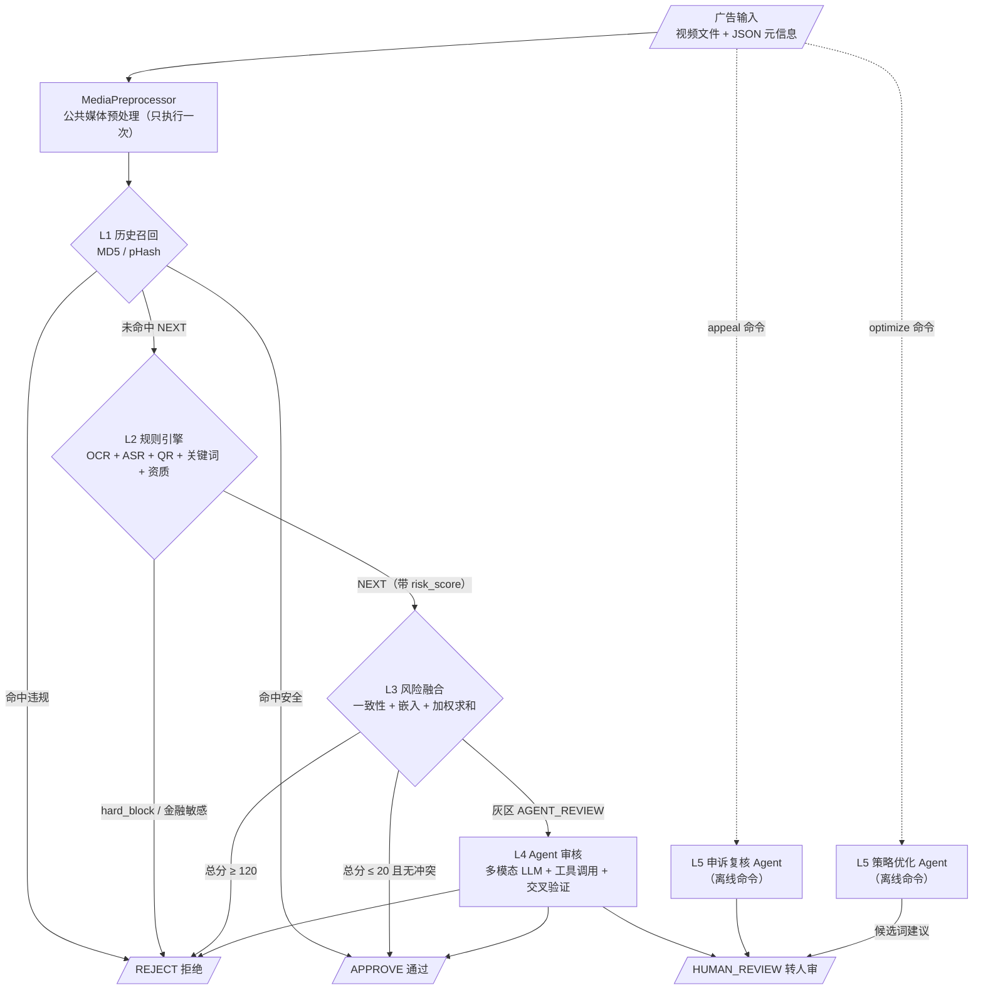
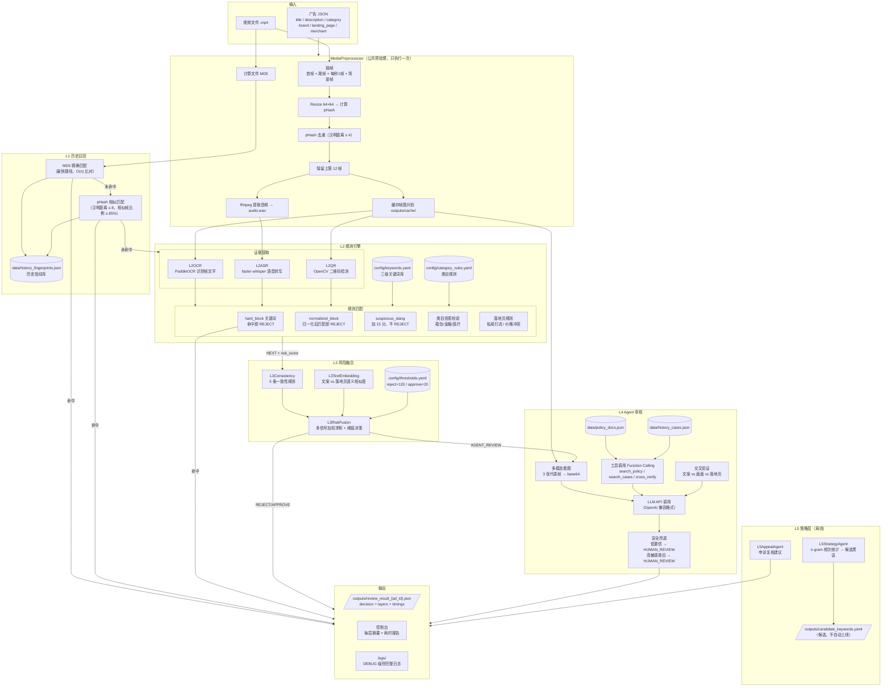

# 系统架构详解

## 架构简图



---

## 架构详图



---

## 第 0 层：MediaPreprocessor（公共媒体预处理）

**文件**：`modules/media_preprocess.py`

**职责**：对输入视频做一次性预处理，结果被后续所有层复用。

**处理流程**：

| 步骤 | 操作 | 输出 |
|------|------|------|
| 1 | 计算文件 MD5 | `file_md5`（16 进制字符串） |
| 2 | OpenCV 读取视频元信息 | fps、frame_count、width、height、duration |
| 3 | 抽帧：首帧 + 尾帧 + 固定间隔 + 场景帧 | 候选帧列表 |
| 4 | 每帧 resize 到 64×64 → imagehash.phash | pHash hex 字符串 |
| 5 | 基于汉明距离 ≤ 4 去重 | 去重后帧列表 |
| 6 | 保留上限 12 帧（超出时均匀降采样） | 最终关键帧 |
| 7 | 帧图片保存到 `outputs/cache/{ad_id}/frames/` | 帧文件路径 |
| 8 | ffmpeg 提取音频 | `outputs/cache/{ad_id}/audio.wav` |

**降级**：视频不存在 → 返回 mock MediaResult（空帧、空指纹），后续层使用 JSON 中的 mock 字段。

---

## 第 1 层：L1 历史召回

**文件**：`modules/l1_history_recall.py`

**职责**：用 MD5 和 pHash 快速判断是否为已知违规/安全素材。

**匹配策略**：

```
Step 1: MD5 精确匹配（O(n) 遍历历史库）
  ├── 命中 violation → REJECT（终止）
  ├── 命中 safe → APPROVE（终止）
  └── 未命中 → Step 2

Step 2: pHash 相似匹配
  ├── 对每条历史指纹，计算"相似帧比例"
  │   = 当前视频中与历史帧汉明距离 ≤ 8 的帧数 / 当前视频总帧数
  ├── 最佳匹配比例 ≥ 0.85 → 命中
  │   ├── label=violation → REJECT（终止）
  │   └── label=safe → APPROVE（终止）
  └── 未命中 → NEXT（进入 L2）
```

**数据依赖**：`data/history_fingerprints.json`（由 `scripts/build_history_fingerprints.py` 生成）

**设计原则**：不调用任何 AI 模型，纯数值计算，耗时 < 1ms。

---

## 第 2 层：L2 规则引擎

### 2.1 证据提取子模块

| 子模块 | 文件 | 输入 | 输出 | 模型 |
|--------|------|------|------|------|
| L2OCR | `modules/l2_ocr.py` | 关键帧图片 | 每帧文字列表 | PaddleOCR（本地） |
| L2ASR | `modules/l2_asr.py` | audio.wav | 转写文本 | faster-whisper（本地 GPU） |
| L2QR | `modules/l2_qr.py` | 关键帧图片 | 二维码内容 | OpenCV QRCodeDetector |

### 2.2 规则匹配（L2RuleEngine）

**文件**：`modules/l2_rule_engine.py`

**文本源列表**（逐源匹配，精确记录命中来源）：
1. `title` — 广告标题
2. `description` — 广告描述
3. `ocr:frame_0001` ~ `ocr:frame_000N` — 每帧 OCR 文字
4. `asr` — ASR 转写文本
5. `landing_page` — 落地页文本

**匹配顺序（否决项优先）**：

| 优先级 | 规则 | 命中行为 | 加分 |
|--------|------|---------|------|
| 1 | hard_block 关键词 | **立即 REJECT** | +40 |
| 2 | normalized_block（归一化后匹配） | **立即 REJECT** | +40 |
| 3 | 金融敏感宣称 + 无金融资质 | **立即 REJECT** | +40 |
| 4 | suspicious_slang 黑话 | 加分，不 REJECT | +15/词 |
| 5 | 缺品牌/医疗资质 | 加分 | +30 |
| 6 | 落地页私域引流 | 加分 | +20 |
| 7 | 落地页价格冲突 | 加分 | +10 |

**文本归一化**（匹配前执行）：
- Unicode NFKC（全角→半角）
- 转小写
- 去除空格和标点
- 替换表：`v信→微信`、`1比1→1:1`、`wx→微信`

**输出**：`decision=REJECT`（否决项命中）或 `decision=NEXT`（带 risk_score 和 signals 进入 L3）

---

## 第 3 层：L3 风险融合

### 3.1 一致性校验（L3Consistency）

**文件**：`modules/l3_consistency.py`

5 条规则检测"文案宣称"与"实际情况"的矛盾：

| # | 规则 | 条件 | 加分 |
|---|------|------|------|
| 1 | 官方正品 + 无授权 | 文案含"官方正品" + brand_authorization=null | +30 |
| 2 | 正品 vs 渠道货 | 文案含"正品" + 落地页含"渠道货/尾单/复刻" | +20 |
| 3 | 价格冲突 | 文案含"低价/免费" + 落地页 price > 100 | +20 |
| 4 | 类目错挂 | category=日用品 + 文本含"减肥/治疗/理财" | +30 |
| 5 | 私域引流冲突 | 文案含"平台内购买" + 落地页含"微信咨询" | +25 |

### 3.2 文本嵌入相似度（L3TextEmbedding）

**文件**：`modules/l3_text_embedding.py`

- 输入：广告侧文本（title+desc+OCR+ASR）vs 落地页文本
- 模型：sentence-transformers（paraphrase-multilingual-MiniLM-L12-v2）
- 计算 cosine 相似度
- 相似度 < 0.5 → 加 10 分（文案和落地页说的不是一回事）

### 3.3 风险融合决策（L3RiskFusion）

**文件**：`modules/l3_risk_fusion.py`

汇总所有信号的 score_delta + 商家历史违规（+10）+ 低嵌入相似度（+10）：

| 总分范围 | 决策 | 含义 |
|---------|------|------|
| ≥ 120 | **REJECT** | 高风险，直接拒绝 |
| ≤ 20 且无冲突信号 | **APPROVE** | 低风险，直接通过 |
| 21 ~ 119 或有冲突信号 | **AGENT_REVIEW** | 灰区，需要 Agent 深度审核 |

**冲突信号**（有这些信号时即使分数低也强制进入 Agent）：
- L3_OFFICIAL_NO_AUTHORIZATION
- L3_OFFICIAL_VS_CHANNEL
- L3_PRICE_CONFLICT
- L3_CATEGORY_MISMATCH
- L3_PRIVATE_DOMAIN_CONFLICT

---

## 第 4 层：L4 Agent 审核

**文件**：`modules/agent_client.py`、`modules/l4_agent_review.py`

**触发条件**：仅当 L3 输出 `AGENT_REVIEW` 时执行。

### 4.1 多模态看图

从 MediaPreprocessor 缓存的关键帧中选 3 张代表帧（首帧 + 中间帧 + 尾帧），转 base64 编码，随 prompt 一起发给 LLM。Agent 可以直接"看到"广告画面内容。

### 4.2 工具调用（Function Calling）

| 工具名 | 功能 | 实现方式 |
|--------|------|---------|
| `search_policy(query)` | 检索审核政策条文 | Jaccard 文本检索 policy_docs.json，返回 top-3 |
| `search_cases(query)` | 检索历史审核案例 | Jaccard 文本检索 history_cases.json，返回 top-3 |
| `cross_verify(claim, evidence, aspect)` | 交叉验证文案与证据一致性 | 本地规则匹配（brand/price/category/drainage） |

LLM 自主决定是否调用工具。工具在本地执行，结果返回给 LLM 做最终判断。

### 4.3 交叉验证

Agent 被要求做三维交叉验证：

| 维度 | 对比内容 | 关注点 |
|------|---------|--------|
| 文案 vs 画面 | 广告文案 vs 视频截图 | 画面有没有品牌标识？做工是否精细？ |
| 文案 vs 落地页 | 广告文案 vs landing_page.text | "正品" vs "渠道货"矛盾？ |
| 画面 vs 落地页 | 视频截图 vs landing_page.text | 画面展示的商品与落地页描述一致？ |

### 4.4 安全兜底机制

| 条件 | 行为 |
|------|------|
| Agent 置信度 < 0.7 | 强制 HUMAN_REVIEW |
| 高敏感类目（金融/医疗）且 Agent 说 APPROVE | 强制改为 HUMAN_REVIEW |
| Agent 返回非法 JSON | 尝试修复，失败则 HUMAN_REVIEW |
| LLM API 超时（120s） | 降级为 HUMAN_REVIEW |
| 无 LLM API Key | 使用 MockAgent（确定性规则） |

### 4.5 Agent 输出结构

```json
{
  "decision": "REJECT | APPROVE | HUMAN_REVIEW",
  "confidence": 0.0-1.0,
  "risk_types": ["brand_counterfeit", "private_drainage"],
  "evidence_chain": ["文案宣称正品但落地页含渠道货表述", "..."],
  "policy_refs": ["policy_brand_001"],
  "reason": "综合判断...",
  "visual_analysis": "画面中展示的包包无品牌标识...",
  "cross_verification": {
    "claim_vs_visual": "文案说官方正品，但画面无品牌 logo",
    "claim_vs_landing": "文案说正品，落地页说渠道货，存在矛盾",
    "visual_vs_landing": "画面商品与落地页描述基本一致"
  }
}
```

---

## 第 5 层：L5 策略层（离线）

### 5.1 申诉复核 Agent

**文件**：`modules/l5_appeal_agent.py`

**触发**：`python main.py appeal --appeal samples/appeal_001.json`

**流程**：
1. 读取原始审核结论（`outputs/review_result_{ad_id}.json`）
2. 读取商家申诉文本
3. 检索相关政策文档
4. Agent 输出建议（不直接改判）

**输出取值**：
- `KEEP_REJECT`：维持原判
- `SUGGEST_APPROVE_AFTER_HUMAN_REVIEW`：建议人工复核后通过
- `NEED_MORE_MATERIALS`：需要商家补充材料
- `HUMAN_REVIEW`：无法判断，转人工

### 5.2 策略优化 Agent

**文件**：`modules/l5_strategy_agent.py`

**触发**：`python main.py optimize --logs data/optimization_logs.json`

**流程**：
1. 分析历史误判/漏判/申诉日志
2. 用 n-gram（n=2~6）频次统计发现高频新词
3. 过滤已有词库中的词，保留频次 ≥ 2 的候选
4. 输出候选词建议 + 验证计划 + 风险评估

**输出**：
- `outputs/strategy_suggestion.json`：策略建议 JSON
- `outputs/candidate_keywords.yaml`：候选关键词（标注 `status: candidate`、`auto_apply: false`）

**设计原则**：Agent 不直接修改任何 `config/*.yaml` 文件，只输出建议。

---

## 统一输出结构

每一层的输出都是 `LayerResult`：

```json
{
  "layer": "L1 | L2 | L3 | L4",
  "decision": "APPROVE | REJECT | NEXT | AGENT_REVIEW | HUMAN_REVIEW",
  "risk_score": 0,
  "reason_code": "L2_HARD_BLOCK_HIT",
  "reason": "命中强违规关键词: 高仿，来源: ocr:frame_0003",
  "signals": [
    {"source": "keyword", "code": "L2_HARD_BLOCK_HIT", "detail": "高仿 (来源: ocr:frame_0003)", "score_delta": 40}
  ],
  "evidence": [
    {"source": "keyword", "raw": "高仿", "normalized": "高仿", "location": "ocr:frame_0003"}
  ],
  "extra": {}
}
```

最终审核结果 JSON 包含所有执行过的层的 `LayerResult` + `timings`（每个节点耗时）。

---

## 配置与数据依赖

| 文件 | 用途 | 被哪层使用 |
|------|------|-----------|
| `config/runtime.yaml` | 运行时开关和模型配置 | 所有层 |
| `config/thresholds.yaml` | 决策阈值 | L1、L3、L4 |
| `config/keywords.yaml` | 三级关键词库 | L2 |
| `config/category_rules.yaml` | 类目资质规则 | L2 |
| `data/history_fingerprints.json` | 历史指纹库 | L1 |
| `data/policy_docs.json` | 审核政策文档 | L4 |
| `data/history_cases.json` | 历史审核案例 | L4 |
| `data/optimization_logs.json` | 优化日志 | L5 |
| `.env` | LLM API 配置 | L4、L5 |
| `models/` | 本地 AI 模型 | L2（OCR/ASR）、L3（嵌入） |
